<!-- _class: lead -->
<!-- _paginate: false -->

# 開発生産性に関する 調査報告

## AI エージェント時代の開発基盤に関する技術提案

{{PRESENTER_NAME}}
2026 年 5 月 18 日

Draft 20260518

---

# 本資料の構成

**第 1 部 — 背景**
1. なぜ今この話か
2. 現状の開発環境

**第 2 部 — 方向性**
3. AI エージェント時代に必要な土台
4. 仕様駆動開発の運用ループ

**第 3 部 — 各論**
5-1. 設計書 (JSON 原本 + 多形式出力)
　　└ ツール構想 + プロトタイプ提案
5-2. GitHub + Kanban
5-3. コンテナ開発
5-4. IDE (Eclipse → VSCode)
5-5. 障害管理 + Issue knowledge base
5-6. AI ツール (なぜ複数併用か)

**第 4 部 — 移行とリスク**
6. 項目別導入タイミング + ハード現実
7. リスク・コスト・反対意見
8. 期待される効果

<!--
speaker notes:
- 約 40-50 分の調査報告 + 技術提案
- 本資料は調査と技術選択肢の提示が目的、計画書ではない
-->

---

<!-- _class: chapter -->

# なぜ今この話か

---

<h1 data-eyebrow="01 / Background">業界の潮目が変わった</h1>

- 2025-2026 年で **AI コーディングツールが「補完」から「タスク遂行 (エージェント)」へ質的変化**
- 競合・ベンダーは GitHub + AI エージェントが標準化
- 一方、社内は SVN / ホスト Eclipse / Oracle VM / Excel 管理が継続
- 本資料は「AI を導入するために、まず土台を整える」観点で技術選択肢を整理

費用・契約条件は管轄外のため、本資料では AI を用いた公開情報調査ベースの客観情報として扱う。最終判断には担当部門による確認が必要。

---

<h1 data-eyebrow="01 / Scope">本資料で扱う問題は、個別ツールの置換ではない</h1>

  

    <h3>AI エージェント導入</h3>
    
Web チャット利用だけでは、設計・実装・検証・レビューを継続的に扱うには不足する。

  

  

    <h3>開発基盤の再現性</h3>
    
VM 配布・ホスト Eclipse・案件別環境差は、AI 以前に人間の開発効率も下げる。

  

  

    <h3>情報の機械可読化</h3>
    
Excel 仕様書・障害管理・WBS は、人間向けの運用には馴染むが AI の入力には弱い。

  

<blockquote>
SVN / Excel / VM / IDE / AI は別々の論点に見えるが、根は <strong>開発情報と環境が機械可読・追跡可能・再現可能になっていない</strong> こと。
</blockquote>

---

<!-- _class: chapter -->

# 現状の開発環境

---

<h1 data-eyebrow="02 / Current">現状の開発環境</h1>

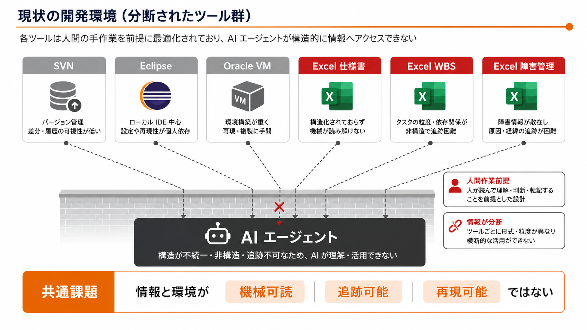

対象: SVN / Eclipse / Oracle VM / Excel 仕様書 / Excel 障害管理 / Excel WBS。個別最適ではなく、AI 時代の開発基盤として一体で見直す。

---

<h1 data-eyebrow="02 / Current">"属人化" のコスト</h1>

### 開発者体験
- 新人オンボード: 環境構築だけで数営業日を要することがある
- 障害対応: 過去の類似事例は Excel ファイル横断検索でしか辿れない
- レビュー: SVN diff の交換のみ、議論が残らない
- **ホスト直接開発のため、Node / JDK 等のバージョンが案件間で衝突**、個人差も生じる

### AI 活用の前提条件
- コードを AI に読ませる経路が無い
- 設計書 (Excel) を AI に読ませても情報が落ちる
- タスク (Excel) を AI に渡せない
- 環境 (VM) を AI が再現できない

<blockquote>
共通の根: ツールが <em>人間しか扱えない形式</em> で情報を持っている。
</blockquote>

---

<!-- _class: chapter -->

# AI エージェント時代に必要な土台

---

<h1 data-eyebrow="03 / Foundations">AI エージェントに必要な 4 条件</h1>

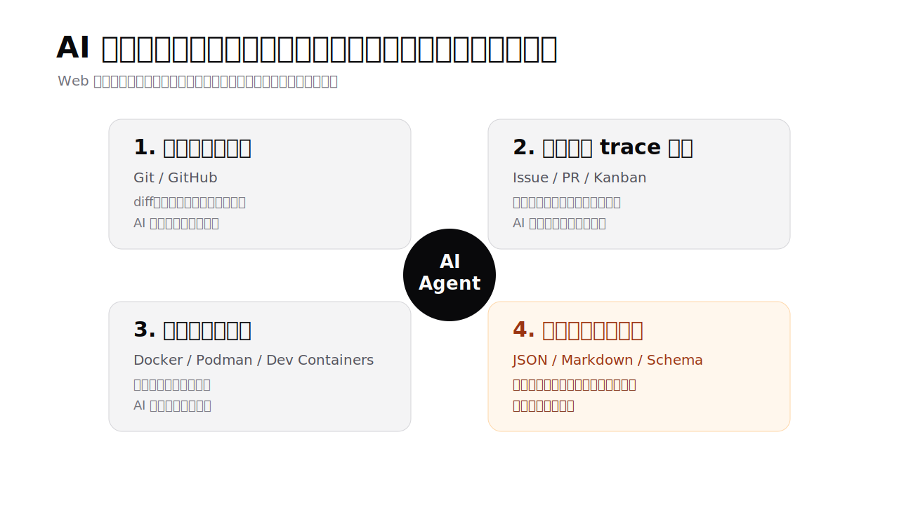

---

<h1 data-eyebrow="03 / Foundations">なぜ Excel 設計書では AI が動けないか</h1>

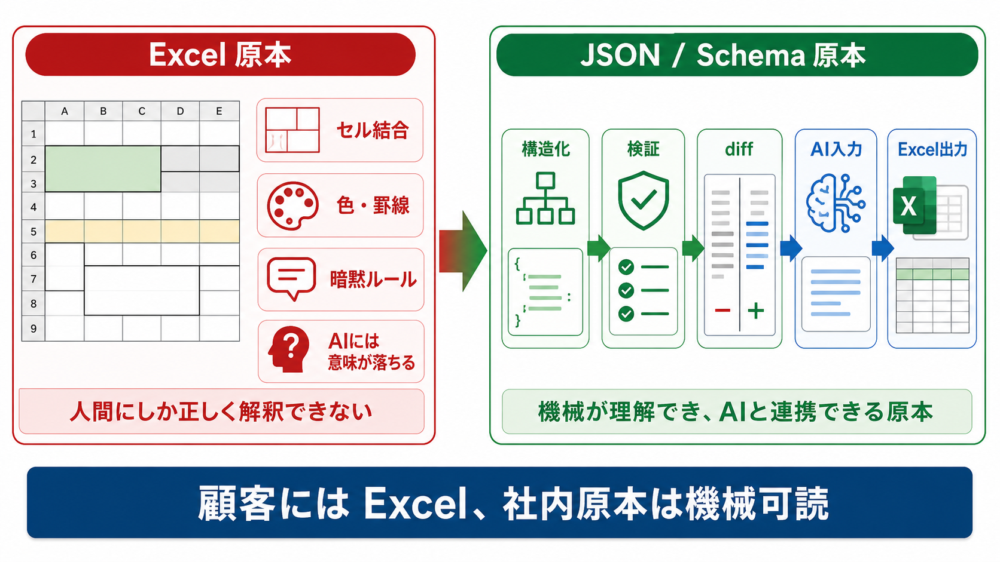

Excel 納品を否定するのではなく、社内原本を JSON / Markdown / Schema に寄せ、必要に応じて Excel を機械生成する考え方 [^1]。

---

<h1 data-eyebrow="03 / Foundations">設計書フォーマットの三段階 — AI 観点での比較</h1>

| 観点 | Excel | Markdown | **JSON + Schema** |
|------|---|---|---|
| AI の理解度 | × バイナリ、書式情報が落ちる | ○ テキスト | **◎ 型・構造が明示** |
| AI 判断のブレ | — | △ 自由記述ゆえブレる | **○ Schema で制約** |
| 機械検証 / 漏れ発見 | × | × | **◎ AJV 等で構造検証** |
| diff | × | ○ | **◎ 構造化** |
| 人間可読性 (生) | ○ | △ 100 行超で見ない | △〜× |
| 人間可読性 (HTML 化後) | △ | ○ MD 構文範囲 | **◎ 任意の複雑表示** |

<blockquote>
<strong>JSON 原本 + HTML 変換</strong> が AI 理解度・人間可読性ともに最良。 
<small>役割分担: 構造化データは JSON、説明文は Markdown、レビューは HTML、納品は Excel (機械変換)。</small>
</blockquote>

---

<!-- _class: chapter -->

# 仕様駆動開発の運用ループ

---

<h1 data-eyebrow="04 / The loop">通常開発も障害対応も、同じプリミティブで回す</h1>

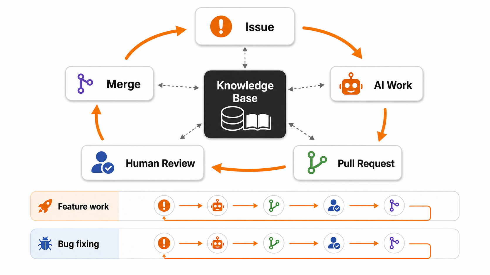

両者は <strong>同じプリミティブ (Issue / AI / PR / レビュー)</strong> で回る。 
すべての作業履歴が GitHub に集約され、AI も人間も後から経緯を辿れる。

---

<!-- _class: chapter -->

# 各論

---

<h1 data-eyebrow="05.1 / Specifications">設計書: JSON 原本 + 多形式出力</h1>

  
JSON <small>原本 (single source of truth)</small>

  

    
HTML <small>開発中レビュー</small>

    
Excel <small>顧客納品</small>

    
PDF <small>印刷・配布</small>

    
Markdown <small>Git / AI 入力</small>

    
Word <small>顧客の要望次第</small>

  

- **開発中**: HTML 表示で人間も AI もレビュー (diff 明瞭、検索容易、ブラウザだけで開ける)
- **納品時**: 同じ JSON から **Excel を機械生成** → 顧客は今までと同じ形式を受け取る
- 形式間のズレは **原本が 1 つ** なので原理的にゼロ
- 変換ライブラリは枯れた領域: Apache POI / openpyxl / ExcelJS / EPPlus 等 [^2]

<blockquote>
「Excel 納品しか許されないから Excel で書く」は技術的に解消可能。 
顧客満足を維持しつつ、社内の生産性を最大化できる。
</blockquote>

---

<h1 data-eyebrow="05.1 / Specifications">AI による仕様 ⇔ 実装の整合性チェック</h1>

### 仕様 → 実装の検証
- JSON 設計書を AI に渡し、実装コードと突合
- 仕様外の挙動、未実装機能、命名揺れを自動検出
- レビュー前段でズレを潰せる

### 仕様 → テストコード自動生成
- JSON 設計書からテストケースを機械抽出
- Autify Nexus / 富士通の事例: **テスト工数約 40% 削減** [^3]

### 重要な前提
入力 (JSON) が網羅されていれば
変換も検証も機械的に保証される。

入力が曖昧なら
AI 生成物も曖昧になる (Garbage In, Garbage Out)。

→ 設計書の <strong>機械可読性</strong> が生産性の上限を決める。

---

<h1 data-eyebrow="05.1 / Tooling">設計書ツールに求められる機能像 — もし揃えば</h1>

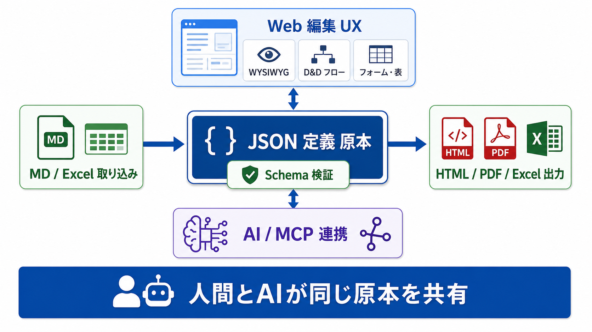

<strong>JSON 定義を原本、JSON Schema を検証契約</strong>として利用する。画面 / 処理フロー / テーブル / 画面遷移 / 規約を機械可読にし、Web 編集 UX と多形式出力を同じ原本に接続する。

ポイントは JSON 原本を Web 上で直接編集できること。Schema が型を強制し、AI も人間も同じ原本を共有できる。

---

<h1 data-eyebrow="05.1 / Tooling">こうしたツールがあれば — 期待される生産性向上</h1>

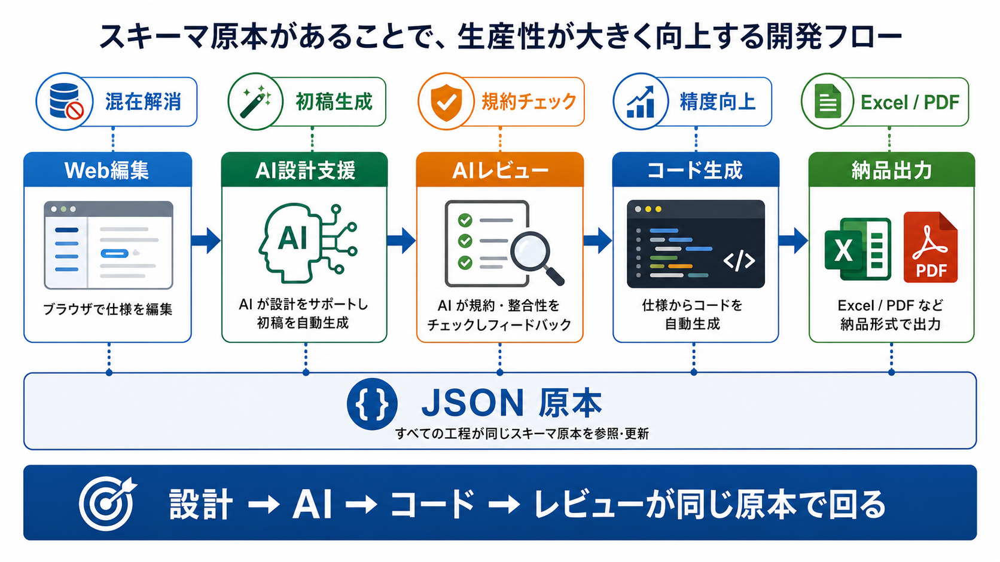

鍵は <strong>設計 → AI → コード → レビューが同じ JSON 原本上で回ること</strong>。原本が 1 つなので、形式間のズレや仕様 / 実装の乖離が発生しにくい。

※ MCP (Model Context Protocol): AI エージェントが外部データ・ツールと構造化通信するための標準仕様。Anthropic が提唱し、対応が広がりつつある。

---

<h1 data-eyebrow="05.1 / Tooling">業界動向 + プロトタイプ作成の提案</h1>

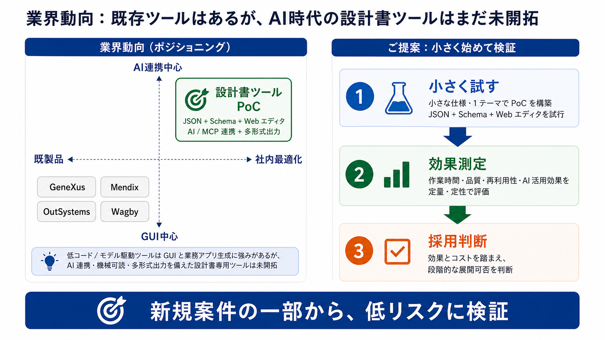

GeneXus / Mendix / OutSystems / Wagby など類似アプローチは存在する。一方で <strong>JSON 原本 + Schema 検証 + Web エディタ + AI / MCP 連携 + 多形式出力</strong> が揃った既製品は、公開情報ベースの調査範囲では限定的。

既存案件は触らず、新規案件の一部または社内プロジェクトで小さく PoC を行い、効果を実機で測定する。

---

<h1 data-eyebrow="05.2 / GitHub">SVN → GitHub: 単なるツール置換ではない</h1>

### ブランチ運用 + PR レビュー
- feature → PR → main の標準フロー
- PR テンプレートで観点を統一
- レビューコメントが永続的に残る

### 自動化 (GitHub Actions)
- test / lint / build を PR 毎に自動実行
- マージ前にデグレを検出
- 手動チェック工数の削減

### AI エージェントの入出力 IF
- Issue が **AI への作業指示** になる
- PR が **AI の成果物** になる
- レビューコメントが **AI への追加指示** になる
- すべてが Git history に残り、後から辿れる

<blockquote>
GitHub は <strong>ソフトウェア開発のデファクトスタンダード</strong>。 
AI と人間の協働インターフェースとしての価値は計り知れない。
</blockquote>

---

<h1 data-eyebrow="05.2 / GitHub">タスク管理: Kanban (GitHub Projects)</h1>

### Excel タスク管理の限界
- 同時編集競合
- 状態遷移が手作業 (更新漏れ多発)
- Issue / PR との紐付けが無い
- AI からアクセス不可

### Kanban (GitHub Projects) の優位性
- Todo / In Progress / Review / Done が一目
- Issue / PR と **自動連動**
- WIP 制限・優先度・担当が可視化
- ガントチャート・ロードマップビューも提供

### AI からのアクセス
- MCP 経由で GitHub Projects も操作可能
- AI が Issue 起票 → 自動で Backlog に登録
- AI が PR 作成 → 自動で Review レーンに移動
- 状態遷移すべてが trace される

### GitHub 上で一元化
- コード / Issue / PR / Kanban / Wiki がすべて同じ場所
- 別ツール (Jira / Backlog / Redmine 等) との連携作業ゼロ

---

<h1 data-eyebrow="05.3 / Containers">VM → コンテナ: 公平な比較</h1>

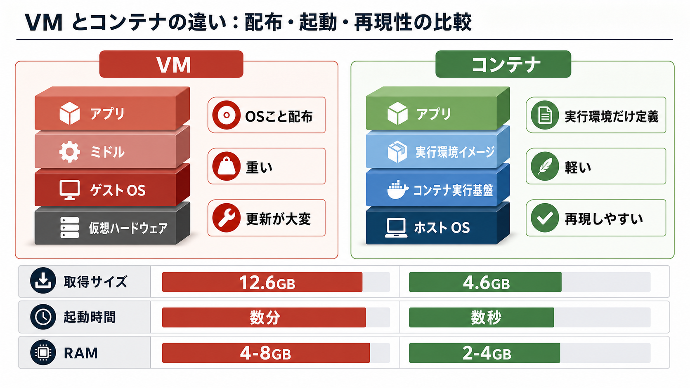

VM の優位はスナップショット巻き戻し。コンテナはタグ管理・Dockerfile・イメージ再配布で、開発環境の再現性を高める [^17]。

---

<h1 data-eyebrow="05.3 / Containers">Windows + コンテナの構成</h1>

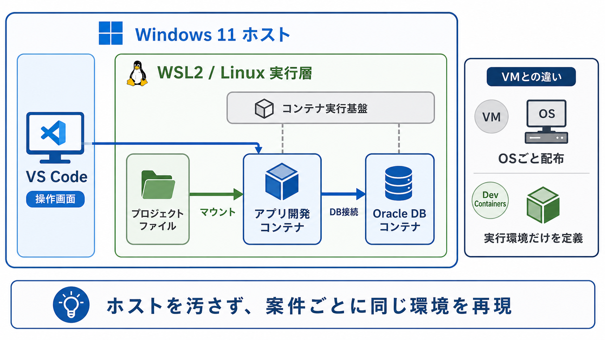

Docker Desktop の代替として Podman も選択肢。重要なのは、ホスト Windows に直接ミドルを入れず、案件ごとの実行環境をコンテナに閉じ込めること。

---

<h1 data-eyebrow="05.3 / Containers">配布イメージ × バージョン隔離</h1>

### 配布イメージのメリット
- 標準環境を **イメージ 1 つ** で配布
- 新規メンバー: pull するだけで開発開始
- ミドル/ライブラリ更新も **イメージ更新で全員に伝播**
- バージョン揃え不要、「自分の PC だけ動く」問題が消える

### ホスト直接開発 vs DevContainers
| | ホスト直接 | Dev Containers |
|---|---|---|
| Node/JDK バージョン管理 | 部分対応 (限界あり) | **Dockerfile で完全固定** |
| 案件間切替 | PATH 書換・再ログイン必要 | **コンテナ切替 (数秒)** |
| 個人差 | **絶対に出る** | **ゼロ** (全員同じ image) |
| ホスト環境 | プロジェクト跨ぐたびに汚れる | **常にクリーン** |

本質的な課題はリソースではなく <strong>環境隔離の有無</strong>。Dev Containers なら案件ごとに完全独立、ホスト汚染ゼロ。

---

<h1 data-eyebrow="05.4 / IDE">IDE: Eclipse → VSCode への自然な流れ</h1>

### シェアと AI 統合の実態 (2025) [^13]
- 全体: **VSCode 75.9%** で 1 位
- Java 限定: IntelliJ 84% / VSCode 31% / **Eclipse 28%** (2024 年 39%、衰退傾向)
- **Eclipse は新規プロジェクトでほぼ選ばれない**、既存改修・legacy 保守が中心
- Eclipse の AI 統合は公式 Copilot プラグインありだが **成熟度は VSCode/Cursor に劣後**
- IntelliJ Ultimate は **有料 ($169/年/人)** で参考のみ

### VSCode を選ぶ 3 つの理由 (本提案の文脈で)
1. **AI エージェント親和性** — Claude Code / Codex / Copilot の主戦場
2. **React フロントエンド親和性** — de facto 標準
3. **Dev Containers 親和性** — 仕様策定元 Microsoft のネイティブ統合

### Cursor (VSCode 派生 AI IDE) の急成長
- VSCode をベースに、AI 補完・チャット・エージェント機能を前面に出した開発環境
- 複数の企業・開発組織で採用が進み、VSCode 系 AI IDE の代表例として伸長中 [^15]
- 重要なのは企業評価額ではなく、**VSCode の延長線上で AI 統合 IDE が普及している**こと

---

<h1 data-eyebrow="05.5 / Bug tracking">障害管理: Excel → GitHub Issues</h1>

### Issue テンプレートで標準化
- 再現手順 / 期待動作 / 実際 / 環境
- ラベルで重要度・影響範囲・担当を可視化
- マイルストーンで対応期限を管理

### AI による初動調査
- 障害 Issue 起票時に AI が関連コード/履歴を自動調査
- 所見を Issue にコメント → 人間が判断

### 経緯がすべて残る
- 障害 Issue ↔ 修正 PR が自動リンク
- レビューコメント、テスト追加、根本原因が同じ場所に集約

### 再発防止が機能する
- Issue クローズ時に「再発防止策」セクション必須化
- 同種 Issue を AI が検出 → アラート

---

<h1 data-eyebrow="05.5 / Bug tracking">Issue は AI 検索可能な組織 knowledge base</h1>

### Excel 時代 vs Issue 化後の差

| シーン | Excel 時代 | Issue + AI |
|---|---|---|
| 新人の質問 | 先輩に聞く / 暗黙知に依存 | **AI が過去 Issue から類似事例を即提示** |
| 障害再発 | 「以前似た障害あった気がする」 | **「3 年前に同症状、原因 X、対応 Y」** |
| 設計判断 | 「過去に検討した気がする」 | **「却下された理由は Z」を発見** |
| 担当者交代 | 引継ぎ資料に数日 | **AI が過去経緯を要約** |

### 累積効果 (同一プロジェクト内)
- Issue 1 つ書くたびに **プロジェクトの knowledge が永続蓄積**
- AI 経由で過去の Issue / PR / コメントを cross-search 可能
- 「個人の記憶」→ **「プロジェクトの検索可能な記録」** へ
- 案件横断の活用は契約・機密が許す範囲で別途検討 (共通テンプレ等)

Issue は単なるタスク管理ではなく <strong>AI で検索できるプロジェクトの knowledge base</strong>。 
<small>これは Excel では原理的に不可能な構造的優位。</small>

---

<!-- _class: chapter -->

# AI ツール — なぜ複数併用か

---

<h1 data-eyebrow="05.6 / AI tools">主要 3 ツールの現在地 (2026 年 5 月)</h1>

| 観点 | GitHub Copilot | Claude Code | Codex (OpenAI) |
|------|---|---|---|
| 主な位置づけ | IDE 内の補完・エージェント機能 | 長文コンテキストを使う CLI エージェント | 実装・検証に強い CLI / ChatGPT / Codex [^5] |
| 開発環境統合 | GitHub / VS Code 連携が強い | MCP / Skills / Hooks / Subagents | 並列 agent / Computer Use / Codex |
| 複数併用 | VS Code 上で Claude / Codex 連携が進行 [^10] | 他エージェントとの役割分担が可能 | Claude Code 用 plugin も提供 [^11] |
| 料金・契約 | 個人プランの新規受付停止など変動あり [^7] | 公開料金・契約条件は要確認 | ChatGPT / API / Codex の契約条件は要確認 [^16] |
| 本資料での扱い | 公式情報ベースの調査対象 | 公式情報ベースの調査対象 | 公式情報ベースの調査対象 |

※ ベンチマーク競争は変動が大きいため本編からは外し、「Web チャットだけではなく、開発環境に統合された agent が必要」という観点に絞る。

---

<h1 data-eyebrow="05.6 / AI tools">なぜ「1 つに賭けない」のか</h1>

### ① スキル・設定の標準化
- MCP / Skills / Hooks / CLAUDE.md など、**プロジェクト固有設定をエージェント間で共有**可
- ベンダーロックインの回避

### ② 業務継続性
- **Claude API は 4-5 月で 5 件以上の incident** [^8]
- **一度落ちるとその日コーディングが停止**することも

### ③ 役割分担 (一例)
orchestrator パターンの **一例**:
- 設計: Claude / 実装: Codex / レビュー: 別モデルで cross-check [^9]
- VS Code が公式 multi-agent 機能提供 (2026-02) [^10]

業界 3 社が「相互運用」に動いた
<small>
• OpenAI: Codex を Claude Code 用プラグインで提供 (2026-03) [^11] 
• GitHub: Copilot が AGENTS.md / CLAUDE.md / Skills を読み込み対応 (進行中) [^12] 
• Microsoft: VS Code Agents App で 3 ツール並列実行可能 [^10]
</small>

---

<!-- _class: chapter -->

# 項目別導入タイミング + ハードウェアの現実

---

<h1 data-eyebrow="06 / Adoption">項目別 × 導入タイミング</h1>

| 要素 | 新規案件 | 既存案件 |
|---|---|---|
| **Git / GitHub** | 即採用 | **1 日で切替** (export/import) |
| **Issue / Kanban** | 即採用 | 即日 (テンプレ整備のみ) |
| **AI エージェント** | 即採用 | 即日 (当初はプロンプトで仕様伝達) |
| **DevContainers** | 即採用 | 並行中 OK (1 人作成→全員) |
| **Oracle VM → コンテナ** | 即採用 | 並行中 OK (Data Pump dump) |
| **設計書 JSON 化** | 即採用 | **次期 v2 / じっくり** (設計書ツール検討) |

<blockquote>
設計書 JSON 化以外はほぼ即日〜短期間で導入可能。 
<small>※ 上記は<strong>システム切替時間</strong>。PR レビュー文化定着など運用面の習熟は別途数ヶ月。</small>
</blockquote>

---

<h1 data-eyebrow="06 / Adoption">ハードウェアの現実</h1>

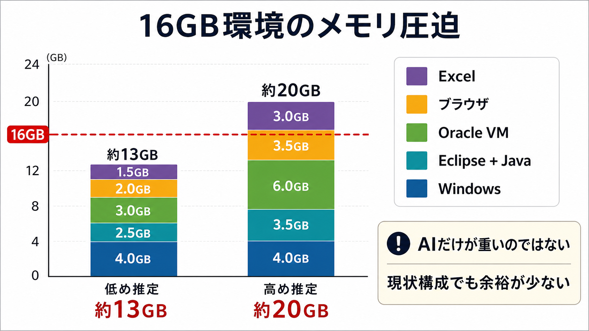

公式最小要件ではなく、VM / IDE / ブラウザ / Excel / AI agent を同時利用する実運用上の推奨として扱う [^14] [^18]。費用判断は担当部門確認が必要。

---

<!-- _class: chapter -->

# リスク・コスト・反対意見

---

<h1 data-eyebrow="07 / Risks">移行コストとリスク</h1>

### 学習コスト
- SVN → Git: 1-2 週間 (PR レビュー文化の定着は数ヶ月)
- Eclipse → VSCode: 1 週間程度
- Excel → JSON/MD: スキーマ理解に数日 (設計書ツール導入で軽減)
- AI エージェント運用: 試行錯誤期間 1-2 ヶ月

### 継続コスト
- AI 関連ツール利用料

### 継続リスク
- **プロジェクトに AI エージェントに詳しい人材が 1 人いるか否かで立ち上がりに顕著な差**
- 全員未経験は立ち上がり困難
- AI モデル選定・プロンプト設計のノウハウ蓄積に時間

### 失敗リスク
- **AI を使いこなせず、AI が何をしているか把握できない問題**
  - 基本: AI が実装、別 AI がレビュー (人間の手作業は減る)
  - 重要: 人間が AI の動きを **把握・統制** する能力
  - 把握できないと品質責任の所在が不明

---

<h1 data-eyebrow="07 / Risks">技術リスク (AI 時代の新規論点)</h1>

### プロンプトインジェクション
- 外部入力 (issue / 設計書 / 顧客テキスト) に悪意ある指示が混入
- AI がそれを実行してしまうリスク
- 機密情報の漏洩、意図しないコード変更
- **対策**: 入力の信頼性管理、AI 権限の最小化

### 隔離環境の必要性
- AI が壊しても安全な実行環境が前提
- **DevContainers / コンテナでの隔離は必須**
- ホスト直接実行は避ける
- 機密リポジトリへのアクセス権も最小化

<strong>AI 時代特有のセキュリティリスクは従来の常識では対応不能。</strong>
<small>プロンプトインジェクション対策と隔離環境の整備は、AI エージェント導入の前提条件。</small>

---

<h1 data-eyebrow="07 / Risks">反対意見への回答</h1>

AI に書かせて品質は大丈夫?

人間レビューは必須、AI cross-check で実は人間 1 人より網羅的に検出可能。テスト工数 40% 削減事例も [^3]。

JSON 設計書、現場が書けるの?

設計書専用ツール (GUI 編集 → JSON 自動出力) で負担軽減可能。手書きが前提ではない。

結局 Excel 納品なら今のままで十分では?

JSON 原本 + 機械変換で **顧客は Excel を受け取り、社内は HTML で生産性最大化**。「Excel 納品」と「Excel で開発」は別問題。

Eclipse から VSCode、学習負担が大きい?

VSCode は学習曲線浅く、AI 補助で更に楽。移行期間 1-2 週間。IntelliJ 利用者には強制移行しない。

AI 利用料・GitHub 費用で逆にコスト増?

テスト工数削減・障害対応効率化・オンボード時間短縮で回収見込み。具体的な ROI は実運用での計測が必要。

---

<h1 data-eyebrow="07 / Risks">現状の利点 (公平視点)</h1>

<h4>現状の利点 (認める)</h4>
<ul>
<li><strong>VM</strong>: スナップショットによる任意時点巻き戻しは確実</li>
<li><strong>Excel 設計書</strong>: 顧客が Office さえあれば編集可能、印刷フォーマット成熟</li>
<li><strong>Eclipse</strong>: 既存プラグイン資産、無料</li>
<li><strong>VPC 配布</strong>: 「環境構築不要」体験を提供</li>
</ul>

<h4>新環境で得るもの</h4>
<ul>
<li><strong>Dev Containers</strong>: 同等の「環境構築不要」体験 + バージョン隔離</li>
<li><strong>JSON 原本</strong>: AI 連携 + 機械変換で Excel 納品も両立</li>
<li><strong>GitHub</strong>: ソフトウェア開発のデファクトスタンダード</li>
<li><strong>VSCode</strong>: AI 統合の最前線、軽量、エコシステム</li>
<li><strong>Issue/Kanban</strong>: タスクと経緯が永続的に trace 可能</li>
</ul>

<blockquote>
新環境は現状の良さを継承しつつ、AI 時代の制約に対応する進化形として設計可能。
</blockquote>

---

<!-- _class: chapter -->

# 期待される効果

---

<h1 data-eyebrow="08 / Outcomes">期待される効果 (他社事例ベース)</h1>

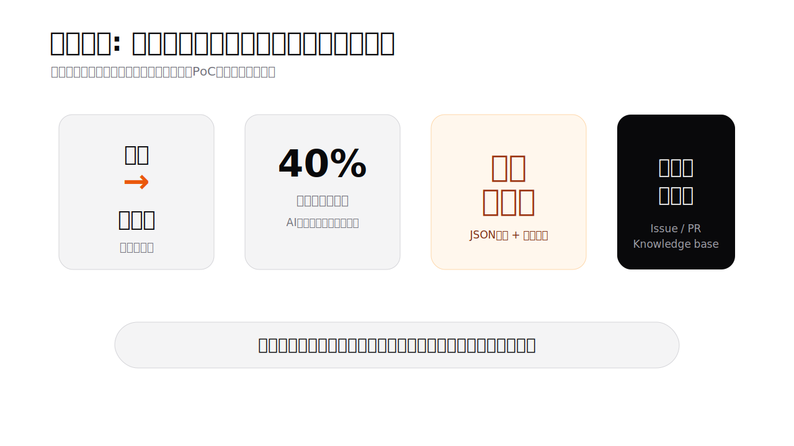

### 数値化しにくい効果

  
<strong>障害対応</strong>: 経緯が辿れ、再発防止が機能する

  
<strong>レビュー品質</strong>: AI 一次レビュー + 人間最終判断で網羅性向上

  
<strong>属人化リスク</strong>: 環境・知見が repository に集約される

  
<strong>開発者体験</strong>: 環境構築・障害調査・設計書執筆の負担を下げる

  
<strong>案件並行</strong>: Dev Containers で案件ごとの環境を保有できる

数値は他社事例 (富士通他 [^3]) や一般的な相場感に基づく。実際の効果は社内環境・案件特性で変動。

---

<h1 data-eyebrow="08 / Outcomes">本資料のまとめ</h1>

- 業界は **AI エージェント時代** に入った
- AI を活かすには **コード・設計書・タスク・環境の機械可読化** が前提
- 仕様駆動開発の運用ループ (Issue → AI → PR → レビュー) が中核モデル
- 技術選択肢:
  - GitHub + Kanban (即日切替可能)
  - DevContainers + Oracle コンテナ (短期間で導入可能)
  - VSCode (Eclipse からの自然な流れ)
  - 設計書の JSON 化 (じっくり、専用ツールのプロトタイプ作成を推奨)
  - AI エージェントの複数併用 (業界 3 社が相互運用へ)
- 新規論点としての **プロンプトインジェクション / 隔離環境** のリスク認識

以上、調査報告および技術選択肢の整理として。記述時点: 2026 年 5 月 18 日、Draft 20260518。

---

<!-- _class: chapter -->

# 参考・出典

---

<h1 data-eyebrow="References">参考・出典 (1/5)</h1>

1. [^1]: Excel 仕様書からの脱却 — https://note.com/yoken_taro/n/n0ba15bad70f5
2. [^2]: JSON → Excel 変換ライブラリ: Apache POI / openpyxl / ExcelJS / EPPlus (各公式 docs)
3. [^3]: 富士通「生成 AI for Software Engineering #3」 — https://blog.fltech.dev/entry/2025/10/29/testspecgen-ja
4. [^4]: CNCF — https://www.cncf.io/
5. [^5]: OpenAI「Introducing GPT-5.5」(2026-04-24) — https://openai.com/index/introducing-gpt-5-5/
6. [^6]: AI ベンチマーク参考 (本編では採用せず) — https://www.vals.ai/benchmarks

---

<h1 data-eyebrow="References">参考・出典 (2/5)</h1>

7. [^7]: GitHub blog「Changes to GitHub Copilot Individual Plans」 — https://github.blog/news-insights/company-news/changes-to-github-copilot-individual-plans/
8. [^8]: Anthropic Status Page — https://status.anthropic.com/
9. [^9]: Addy Osmani「Code Agent Orchestra」 — https://addyosmani.com/blog/code-agent-orchestra/
10. [^10]: VS Code「Multi-Agent Development」(2026-02-05) — https://code.visualstudio.com/blogs/2026/02/05/multi-agent-development
11. [^11]: OpenAI Developer Community「Codex Plugin for Claude Code」(2026-03-30) — https://community.openai.com/t/introducing-codex-plugin-for-claude-code/1378186 / https://github.com/openai/codex-plugin-cc
12. [^12]: GitHub Copilot の AGENTS.md / CLAUDE.md / Skills 対応 — https://github.com/features/copilot/agents / https://code.visualstudio.com/docs/copilot/agents/overview

---

<h1 data-eyebrow="References">参考・出典 (3/5)</h1>

13. [^13]: Stack Overflow Developer Survey 2025 — https://survey.stackoverflow.co/2025/ / JetBrains State of Developer Ecosystem 2025 — https://devecosystem-2025.jetbrains.com/ / JRebel「Most Popular Java IDEs in 2026」 — https://www.jrebel.com/blog/best-java-ide
14. [^14]: Claude Code 公式 setup — https://code.claude.com/docs/en/setup / Visual Studio 2026 System Requirements — https://learn.microsoft.com/en-us/visualstudio/releases/2026/vs-system-requirements
15. [^15]: Cursor 公式サイト / Cursor 事例・紹介情報 — https://cursor.com/ / https://www.nxcode.io/resources/news/windsurf-vs-cursor-2026-ai-ide-comparison

---

<h1 data-eyebrow="References">参考・出典 (4/5)</h1>

**[^16]: GitHub Copilot 課金体系移行**
- multipliers: https://docs.github.com/en/copilot/reference/copilot-billing/model-multipliers-for-annual-plans
- AI Credits 移行: https://github.blog/news-insights/company-news/github-copilot-is-moving-to-usage-based-billing/
- Claude pricing: https://claude.com/pricing / ChatGPT plans: https://chatgpt.com/pricing/

**[^17]: Oracle Linux / Oracle 23ai Free (VM・コンテナサイズ)**
- OL9 ISO: https://yum.oracle.com/oracle-linux-isos.html
- 23ai Free RPM: https://oracle-base.com/articles/23/oracle-db-23-free-rpm-installation-on-oracle-linux-9
- 23ai Free コンテナ: https://blogs.oracle.com/database/announcing-oracle-database-23ai-free-container-images-for-armbased-apple-macbook-computers

---

<h1 data-eyebrow="References">参考・出典 (5/5)</h1>

**[^18]: 16 GB 環境 AI 開発エラー事例**

- Claude Code Issue #21182 (会話 window で 11.6 GB 即消費): https://github.com/anthropics/claude-code/issues/21182
- GitHub Copilot Discussion #163309 (extension host OOM 再起動): https://github.com/orgs/community/discussions/163309
- Square Enix Tech Blog (Dev Container ディスク遅延): https://blog.jp.square-enix.com/iteng-blog/posts/00013-devcontainer-disk-slow/

記述時点: 2026 年 5 月。AI ツール仕様は更新頻繁、利用時は各公式 docs で再確認のこと。

