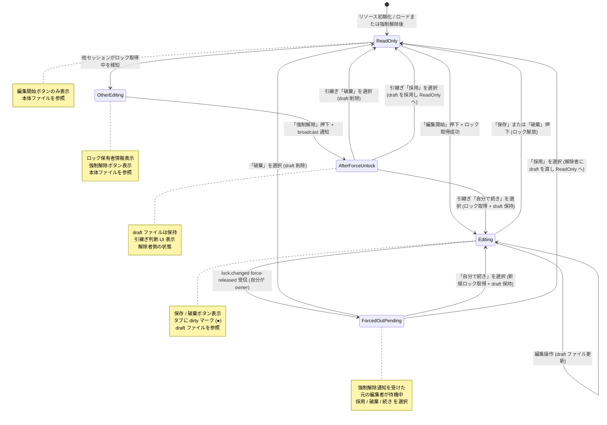

# edit-session-draft — サーバ側 draft 管理モデル仕様

> **シリーズ**: #683 メタ ISSUE / PR-1/7 (本 spec ドキュメント)
>
> 本ドキュメントは設計判断 D-1 〜 D-12 (メタ #683 確定済) を正規仕様として記述する。
> 実装は PR-2 (backend draft 管理) / PR-3 (backend ロック管理) 以降で行う。

---

## 目次

1. [概要 / 動機](#1-概要--動機)
2. [設計判断 D-1 〜 D-12](#2-設計判断-d-1--d-12)
3. [ファイル配置仕様](#3-ファイル配置仕様)
4. [状態遷移図](#4-状態遷移図)
5. [owner / actor 分離モデル (D-7)](#5-owner--actor-分離モデル-d-7)
6. [API シグネチャ (輪郭)](#6-api-シグネチャ-輪郭)
7. [リスクマトリクス](#7-リスクマトリクス)
8. [maturity との関係 (D-9)](#8-maturity-との関係-d-9)
9. [互換性ポリシー](#9-互換性ポリシー)
10. [未解決事項 / 将来 ISSUE](#10-未解決事項--将来-issue)

---

## 1. 概要 / 動機

### 1.1 現状の問題

本アプリには現時点で 3 つの構造的な問題がある。

**問題 A: autosave による即時書込みリスク**

画面デザイナー (GrapesJS) はタイピング・ドラッグのたびに本体ファイルを即時書込みする autosave 方式を採用している。ユーザーがプレビュー目的でちょっと触っただけで本物のデータが書き換わるため、誤改変リスクが恒常的に存在する。編集の意図を持たない操作と、確定的な編集操作の区別がシステムレベルで存在しない。

**問題 B: localStorage への依存**

テーブル定義・処理フロー等の他エディタは「明示保存」方式を採用しているものの、未保存の編集状態は localStorage に保持している。localStorage には以下の脆弱性がある:

- 容量上限が小さい (ブラウザ実装依存、一般に 5-10 MB)
- プライベートモードや別ブラウザでは存在しない
- キャッシュクリア・ブラウザ更新で喪失するリスクがある
- クロスデバイスで参照できない
- サーバ側 (AI エージェント) からは不可視

**問題 C: AI エージェントとの連携における上書き事故リスク**

本アプリは MCP 経由での AI エージェント連携を前提としている。AI エージェントが編集中状態を把握できない場合、人間が編集中のリソースに AI が独立して書込みを行い、上書き事故が発生しうる。AI 側には現在このリスクを防ぐ仕組みがない。

**問題 D: リリース後の git 管理対象化**

リリース後、ワークスペースはエンドユーザーの業務プロジェクトファイル群として git 管理対象となる予定である。そのため本体ファイルへの書込みは確定操作 (ユーザーの明示的な「保存」) のみに絞るべきであり、中間状態のファイルを git 履歴に混入させない仕組みが必要となる。

### 1.2 解決方針

上記の問題を一括解消するため、**サーバ側 draft 管理モデル**を導入する。要点は以下のとおり:

- 全エディタを「編集開始 → 編集 → 保存 or 破棄」の明示モデルに統一
- 編集中の作業コピー (draft) はサーバ側ファイルシステムに保持 (localStorage 依存を廃止)
- per-resource のロック制御で AI エージェントとの衝突を防ぐ
- draft ファイルは `.gitignore` 対象とし、git 履歴に混入させない

---

## 2. 設計判断 D-1 〜 D-12

### D-1: 全エディタを明示保存式に統一 (autosave 廃止)

**ルール**

- 画面デザイナー (GrapesJS) を含む全エディタが「編集開始 → 編集 → 保存 or 破棄」モデルに従う
- 編集開始操作を行うまでは全エディタが read-only 表示となる
- 保存ボタン押下が本体ファイルへの唯一の書込みトリガーとなる

**根拠**

autosave は「常に最新状態をサーバに反映」という単一ユーザー・単一デバイス前提で設計されたモデルであり、AI 連携・マルチデバイス・git 管理対象化のいずれとも相性が悪い。明示保存モデルは「意図を持った操作だけが本体を変える」という直感的な契約を提供する。

**影響範囲**

- PR-6: GrapesJS の autosave 廃止 + 編集モード UI 統合 (大規模変更)
- PR-7: テーブル定義・処理フロー・画面項目・ビュー定義・画面遷移・拡張定義・規約の各エディタ移行

---

### D-2: サーバ側 draft 管理モデル

**ルール**

| 操作 | 処理 |
|---|---|
| 編集開始 | サーバが本体ファイルから draft ファイルを作成する |
| 編集中 | ブラウザは draft ファイルを読み書きする |
| 保存 | draft ファイルを atomic に本体ファイルへ昇格し、draft を削除する |
| 破棄 | draft ファイルを削除する (本体に変更なし) |
| 未保存判定 | draft ファイルが存在すること = 未保存状態 |

- 本体ファイルパス: `data/<resourceType>/<id>.json`
- draft ファイルパス: `data/.drafts/<resourceType>/<id>.json`

**根拠**

ファイルシステムへの永続化により、ブラウザクラッシュ・ネットワーク切断・PC 再起動後でも draft が失われない。「draft ファイルの存在」を未保存フラグとして使うことで、状態管理を DB や追加ストレージなしに実現できる。

**影響範囲**

- PR-2: backend での draft 作成・読取・更新・保存・破棄 API 実装

---

### D-3: ロック式排他制御

**ルール**

- 編集開始ボタン押下 → サーバがロックを取得する
- 保存・破棄ボタン押下 → サーバがロックを解放する
- ロック取得前は全エディタが read-only 状態で表示される
- 同一リソースに対して同時に存在できるロックは 1 つのみ

**根拠**

複数ユーザー・AI エージェントが同一リソースを同時編集した場合の上書き事故を防ぐため、楽観的ロックではなく排他ロックを採用する。読取専用ビューは保証されるため、複数人が同時に参照することは妨げない。

**影響範囲**

- PR-3: backend ロック管理実装
- PR-4: frontend での read-only / 編集中モード UI

---

### D-4: 切断時のロック保持

**ルール**

- WebSocket 切断・ブラウザクラッシュ・PC 落ち時もロックはサーバ側で保持し続ける
- TTL (有効期限による自動解除) は採用しない
- ロック解除の唯一のトリガーは「保存」「破棄」「強制ロック解除」の明示操作

**根拠**

TTL を設けると「作業中に席を外したらロックが消えていた」「AI エージェントが長時間処理中にロックが失効した」等の問題が発生する。また TTL の適切な値はユースケースによって異なり、一律の値を決めることが難しい。強制解除 (D-5) で対処できるため TTL は不採用とする。

**影響範囲**

- PR-3: WS 切断ハンドラでのロック保持ロジック

---

### D-5: 強制ロック解除

**ルール**

- ロックを保有していない任意のセッションが「強制ロック解除」操作を実行できる
- 強制解除時、ワークスペース内の全セッションに broadcast 通知する
- 強制解除後も元の draft ファイルは削除しない (引継ぎ・レビュー用途)
- 強制解除後、解除者は「元 draft を採用 / 破棄 / 自分で編集継続」を選択できる
- 強制解除操作前に確認ダイアログを表示する (PR-4 で実装)

**根拠**

切断したユーザーが長期不在になった場合、他のユーザーや AI エージェントが作業を続けられなくなる。強制解除を許可しつつ元 draft を保持することで、元の作業者が戻った際に自分の変更を確認・採用できる。透明性確保のため broadcast 通知を必須とする。

**影響範囲**

- PR-3: 強制解除 + broadcast 実装
- PR-4: 強制解除ボタン + 確認ダイアログ + 引継ぎ選択 UI
- PR-5: 強制解除受信時のフロントエンド挙動 (dirty マーク表示・draft 復元)

---

### D-6: draft の git 管理対象外

**ルール**

- `data/.drafts/` ディレクトリは `.gitignore` 対象とする
- draft ファイルは個人作業の中間状態であり、チームで共有する必要はない
- 本体ファイルへの昇格 (保存) が完了して初めてチーム共有・git コミットの対象となる

**根拠**

draft は「今まさに編集している途中」の状態であり、git 履歴に残すことで不完全な状態のファイルが蓄積する。意図した保存操作を行った本体ファイルのみを git 管理対象とすることで、git 履歴の意味を保全する。

**影響範囲**

- PR-2: `data/.drafts/` を `.gitignore` に追加

---

### D-7: AI エージェントとロックの関係 (owner / actor 分離)

**ルール**

ロックを「持ち主 (owner)」と「実行者 (actor)」に分離する。詳細は [セクション 5](#5-owner--actor-分離モデル-d-7) を参照。

**根拠**

人間が AI に作業を委任する場合と、AI が独立して動作する場合では、ロックの扱いが異なるべきである。人間委任ケースで AI がロック奪取を行うと不要な通知が発生してノイズになる。独立動作ケースで AI が無条件に書込めると人間の作業を破壊しうる。

**影響範囲**

- PR-3: `onBehalfOfSession` パラメータ受理、owner/actor 分離ロジック
- PR-7: MCP tool への `onBehalfOfSession` 引数追加

---

### D-8: 対象エディタ (全エディタを一括移行)

**ルール**

以下の全エディタを同一モデルに移行する。段階移行は行わない。

| エディタ | 現状 | PR |
|---|---|---|
| 画面デザイナー (GrapesJS) | autosave | PR-6 |
| テーブル定義 | 明示保存 (localStorage 依存) | PR-7 |
| 処理フロー | 明示保存 (localStorage 依存) | PR-7 |
| 画面項目定義 | 明示保存 (localStorage 依存) | PR-7 |
| ビュー定義 | 明示保存 (localStorage 依存) | PR-7 |
| 画面遷移 | 明示保存 (localStorage 依存) | PR-7 |
| 拡張定義 | 明示保存 (localStorage 依存) | PR-7 |
| 規約 | 明示保存 (localStorage 依存) | PR-7 |

**根拠**

エディタごとに異なるモデルが混在すると、ユーザーは保存挙動を学習し直す必要が生じる。一括移行により UI の一貫性を確保する。

---

### D-9: maturity と編集 draft は別軸

**ルール**

- `maturity` (`draft` / `committed`) は業務ライフサイクルの状態を表す
- 編集 draft (edit-session-draft) は一時的な編集セッション状態を表す
- 両者は独立した軸であり、組み合わせ可能

組み合わせ表は [セクション 8](#8-maturity-との関係-d-9) を参照。

**根拠**

maturity=`committed` のリソースが「編集可能でない」わけではない。リリース済みのものを修正するシナリオが存在する。同様に maturity=`draft` のリソースが「常に誰かが編集中」というわけでもない。2 つの概念を混同すると状態管理が複雑化する。

---

### D-10: dirty マーク統一表示

**ルール**

以下の箇所に未保存 (draft 存在) を示すマークを表示する:

| 表示箇所 | マーク仕様 |
|---|---|
| アプリ内タブのタイトル | タイトル末尾に「●」を付加 |
| 一覧画面の各カード | 未保存アイコン (詳細は PR-5 で定義) |
| 強制解除後の引継ぎセッション | draft 存在を即座に表示 |

**根拠**

ユーザーが「自分の変更が保存されているかどうか」を常に確認できるようにする。VS Code のタブ「●」マークは広く認知されているパターンであり、学習コストが低い。

**影響範囲**

- PR-5: タブ dirty マーク + カード未保存マーク + draft 復元表示

---

### D-11: 編集モード UI

**ルール**

エディタの UI 状態と表示要素:

| 状態 | 表示要素 |
|---|---|
| read-only モード | 「編集開始」ボタンのみ表示 |
| 編集中モード (自分がロック保有) | 「保存」ボタン + 「破棄」ボタン |
| 他セッションが編集中 | ロック保有者のセッション情報表示 + 「強制解除」ボタン |

**根拠**

状態に応じた明確な UI により、ユーザーが「自分は今編集できるのか」「誰が編集しているのか」を瞬時に把握できる。

**影響範囲**

- PR-4: 全エディタへの編集モード UI 実装 (大規模 UI 変更)

---

### D-12: マルチワークスペース対応 (#679) との関係

**ルール**

- 本シリーズ (#683 PR-1〜7) では draft パスに workspace ID を含めない
- #679 (マルチワークスペース) の PR-3/5 完了後、draft パスを以下に変更する:
  - 変更前: `data/.drafts/<resourceType>/<id>.json`
  - 変更後: `data/.drafts/<wsId>/<resourceType>/<id>.json`
- #683 完了後、#679 に着手する順序を守る

**根拠**

#679 の localStorage 関連作業の多くは本シリーズで代替される。パスに `wsId` を含める変更は #679 で一括対応することで、本シリーズの scope を絞り実装リスクを下げる。

**影響範囲**

- 本シリーズ PR-2: パスは `wsId` なし形式で実装
- #679 での変更: パスに `wsId` を追加

---

## 3. ファイル配置仕様

### 3.1 本体ファイル

確定した状態を保持するファイル。保存操作により draft から昇格する。

```
data/
  screens/          # 画面デザイナー
    <id>.json
  tables/           # テーブル定義
    <id>.json
  process-flows/    # 処理フロー
    <id>.json
  screen-items/     # 画面項目定義
    <id>.json
  views/            # ビュー定義
    <id>.json
  sequences/        # 画面遷移
    <id>.json
  actions/          # 拡張定義
    <id>.json
  conventions/      # 規約
    <id>.json
```

### 3.2 draft ファイル

編集中の作業コピー。本体と同じ `resourceType/id` 構造を `.drafts/` 配下に持つ。

```
data/
  .drafts/
    screens/
      <id>.json     # 画面デザイナーの draft
    tables/
      <id>.json
    process-flows/
      <id>.json
    screen-items/
      <id>.json
    views/
      <id>.json
    sequences/
      <id>.json
    actions/
      <id>.json
    conventions/
      <id>.json
```

### 3.3 `.gitignore` 設定

```
# 編集中 draft ファイル (個人の作業中間状態、git 管理対象外)
data/.drafts/
```

`data/` 自体は既に `.gitignore` 対象だが、draft ディレクトリの意図を明示するため個別にコメント付きで追記する (PR-2 で対応)。

### 3.4 将来の wsId パス (#679 対応後)

#679 (マルチワークスペース) 完了後、draft パスに workspace ID が追加される。

```
data/
  .drafts/
    <wsId>/           # workspace ID (例: ws-abcd1234)
      screens/
        <id>.json
      tables/
        <id>.json
      ...
```

移行方法は #679 のスコープで定義する。本シリーズ (#683) の実装は `wsId` なしパスで行い、#679 でパスを変更する。

---

## 4. 状態遷移図

以下の mermaid 図はリソース 1 件に対する編集セッション状態を示す。



### 4.1 状態定義

| 状態 | 説明 | ロック | 参照ファイル |
|---|---|---|---|
| `ReadOnly` | 誰もロックしていない初期状態。自分も他者もロックしていない | なし | 本体 |
| `Editing` | 自分がロックを保有し編集中 | 自分 | draft |
| `OtherEditing` | 他セッションがロックを保有している | 他者 | 本体 |
| `AfterForceUnlock` | 強制解除を実行した側の引継ぎ判断待ち状態 | なし (解除済) | draft (保持) |
| `ForcedOutPending` | 強制解除を受けた側 (元の編集者) が「採用 / 破棄 / 続き」を選択する待機状態 | なし (剥奪済) | draft (保持) |

### 4.2 遷移トリガー

| 遷移 | トリガー | 前提条件 |
|---|---|---|
| ReadOnly → Editing | 「編集開始」押下 | ロックが存在しないこと |
| ReadOnly → OtherEditing | WS 通知受信 (他者がロック取得) | |
| Editing → ReadOnly | 「保存」または「破棄」押下 | 自分がロック保有 |
| Editing → ForcedOutPending | `lock.changed force-released` broadcast 受信 (自分が owner) | 自分がロック保有中に強制解除される |
| OtherEditing → AfterForceUnlock | 「強制解除」押下 + 確認 | 自分がロックを持たないこと |
| AfterForceUnlock → Editing | 引継ぎ「自分で続き」選択 | |
| AfterForceUnlock → ReadOnly | 引継ぎ「破棄」選択 または 「採用」選択 | |
| ForcedOutPending → ReadOnly | 「破棄」選択 (draft 削除) | 元の編集者が操作 |
| ForcedOutPending → Editing | 「自分で続き」選択 (新規ロック取得 + draft 保持) | 元の編集者が操作 |
| ForcedOutPending → ReadOnly | 「採用」選択 (解除者に draft を渡し自分は ReadOnly へ) | 元の編集者が操作 |

---

## 5. owner / actor 分離モデル (D-7)

### 5.1 概念定義

| 役割 | 説明 |
|---|---|
| **owner** | ロックの「持ち主」。ロック取得・解放の権限を持つ。人間のセッション ID |
| **actor** | 実際に書込みを行う「実行者」。owner とは別の存在でありうる |

### 5.2 シナリオ表

| シナリオ | owner | actor | ロック奪取 | 通知 |
|---|---|---|---|---|
| **A: 人間が AI に依頼** | 人間のセッション | AI エージェント | なし (人間ロックの中で AI 書込み) | なし (ノイズ回避) |
| **B: AI 独立動作** | AI エージェント | AI エージェント | あり (人間ロックを強制解除) | broadcast 通知 + draft 保持 |

### 5.3 シナリオ A の詳細 (人間 → AI 委任)

```
1. 人間がエディタで「編集開始」→ ロック取得 (owner=人間セッション)
2. 人間が MCP 経由で AI に「この処理フローを修正して」と依頼
3. AI のツール呼び出しに onBehalfOfSession: "<人間セッションID>" を含める
4. サーバは owner=人間セッション, actor=AI として処理
5. AI が draft ファイルを更新 (ロック奪取なし)
6. 人間が結果を確認し「保存」または「破棄」を選択
```

### 5.4 シナリオ B の詳細 (AI 独立動作)

```
1. AI エージェントがリソースを修正しようとする
2. リソースにロックがある場合: D-5 と同様に強制解除 + broadcast 通知 + draft 保持
3. AI がロックを取得 (owner=AI セッション)
4. AI が draft ファイルを作成・更新
5. AI が保存操作を実行 → 本体ファイルに昇格
```

### 5.5 onBehalfOfSession パラメータ

```typescript
// 詳細は PR-3/PR-7 実装時に fix する
interface LockAwareWriteParams {
  resourceType: string;
  resourceId: string;
  content: unknown;
  onBehalfOfSession?: string; // シナリオ A で使用。有効なセッション ID のみ受理
}
```

`onBehalfOfSession` は optional。省略した場合、AI エージェント自身のロック取得が必要となる (シナリオ B)。偽装防止のため、サーバは `onBehalfOfSession` に指定された session ID が有効なアクティブセッションであることを検証する。

---

## 6. API シグネチャ (輪郭)

> **注意**: 本セクションの API シグネチャは設計の輪郭であり、詳細は実装 PR での確定値に従う。
> - PR-2 で fix: draft 管理系 tool (`draft_open`, `draft_save`, `draft_discard`, `draft_get`)
> - PR-3 で fix: ロック管理系 tool (`lock_acquire`, `lock_release`, `lock_force_release`, `lock_status`)
> - PR-7 で fix: `onBehalfOfSession` 対応、AI 向け E2E

### 6.1 draft 管理系 MCP tool (PR-2 で fix)

```typescript
// draft_open: 編集開始 — 本体から draft を作成する
// 引数
{
  resourceType: string; // "screens" | "tables" | "process-flows" | ...
  resourceId: string;
  sessionId: string;
}
// 戻り値
{
  success: boolean;
  draftPath: string;         // data/.drafts/<resourceType>/<id>.json
  content: unknown;          // draft の初期内容 (本体のコピー)
  lockAcquired: boolean;
}

// draft_save: 保存 — draft を atomic に本体へ昇格し draft を削除する
// 引数
{
  resourceType: string;
  resourceId: string;
  sessionId: string;
  content: unknown;          // 保存する内容
}
// 戻り値
{
  success: boolean;
  savedPath: string;         // data/<resourceType>/<id>.json
}

// draft_discard: 破棄 — draft を削除し本体は変更しない
// 引数
{
  resourceType: string;
  resourceId: string;
  sessionId: string;
}
// 戻り値
{
  success: boolean;
}

// draft_get: draft 内容の読取
// 引数
{
  resourceType: string;
  resourceId: string;
}
// 戻り値
{
  exists: boolean;
  content: unknown | null;
  lockOwner: string | null;  // ロック保有者のセッション ID
}
```

### 6.2 ロック管理系 MCP tool (PR-3 で fix)

```typescript
// lock_acquire: ロック取得
// 引数
{
  resourceType: string;
  resourceId: string;
  sessionId: string;
}
// 戻り値
{
  success: boolean;
  lockId: string;
  owner: string;             // セッション ID
}

// lock_release: ロック解放 (保存または破棄時に呼ばれる)
// 引数
{
  resourceType: string;
  resourceId: string;
  sessionId: string;
}
// 戻り値
{
  success: boolean;
}

// lock_force_release: 強制解除
// 引数
{
  resourceType: string;
  resourceId: string;
  requestingSessionId: string; // 解除を要求するセッション
}
// 戻り値
{
  success: boolean;
  previousOwner: string;     // 元ロック保有者
  draftPreserved: boolean;   // draft 保持確認 (常に true)
}

// lock_status: ロック状態確認
// 引数
{
  resourceType: string;
  resourceId: string;
}
// 戻り値
{
  locked: boolean;
  owner: string | null;
  hasDraft: boolean;
}
```

### 6.3 broadcast イベント (PR-3 で fix)

ロック状態変化時に WebSocket 経由で workspace 内全セッションに通知する。イベント型は PR-3 で定義する。

```typescript
// broadcast イベント概要 (PR-3 で fix)
type LockEvent =
  | { type: "lock_acquired"; resourceType: string; resourceId: string; owner: string }
  | { type: "lock_released"; resourceType: string; resourceId: string }
  | { type: "lock_force_released"; resourceType: string; resourceId: string; previousOwner: string };
```

---

## 7. リスクマトリクス

| リスク | 影響度 | 対応 PR | mitigation |
|---|---|---|---|
| GrapesJS の autosave 挙動変更で UX 悪化 | 高 | PR-6 | 「編集開始」ボタンを GrapesJS canvas 上にも明示配置。初回ユーザーガイド追加 |
| 既存 localStorage の未保存データ喪失 | 中 | PR-6/7 | 移行時に旧 localStorage 検出 → 1 回 draft に変換。未確定キーは warn log で残す |
| 強制解除の濫用で他人の作業が失われたと感じる | 中 | PR-3/4 | 元 draft 保持 (D-5) + broadcast 通知で透明性確保。解除時に確認ダイアログ表示 |
| draft ファイル爆発 (放置で溜まる) | 低〜中 | PR-2 + 将来 ISSUE | draft 一覧画面は将来 ISSUE で対応。TTL は採用しない (D-4) |
| atomic 保存中の race condition | 中 | PR-2 | tmp ファイル + rename パターンで OS atomic 保証。PR-3 ロックで排他制御 |
| AI の onBehalfOfSession 偽装で乗っ取り | 低 | PR-7 | session 検証 (有効なアクティブ session ID のみ受理)。全操作をログ記録 |
| 編集モード切替で意図せず draft 削除 | 中 | PR-4 | 「破棄」ボタンに確認ダイアログを必須表示 |
| マルチワークスペース時の draft パス衝突 | 中 | #679 | #679 で wsId をパスに含める (D-12) |
| MCP tool 互換性破壊 | 中 | PR-7 | onBehalfOfSession は optional パラメータ。既存 AI tool 呼び出しへの影響なし |
| ロック保有者が長期不在で resource 完全停止 | 低 | PR-3 | 強制解除 (D-5) で対処可能。運用手引きに明記 |

---

## 8. maturity との関係 (D-9)

### 8.1 2 軸の独立性

| 軸 | 値 | 意味 |
|---|---|---|
| `maturity` (業務ライフサイクル) | `draft` | 設計途中。未確定・スキーマ違反あり可 |
| `maturity` (業務ライフサイクル) | `committed` | 確定済。チームで参照・AI が読む準備完了 |
| 編集セッション状態 | `ReadOnly` | 誰も編集していない |
| 編集セッション状態 | `Editing` | 自分が編集中 (draft ファイル存在) |
| 編集セッション状態 | `OtherEditing` | 他者が編集中 |

**2 軸は直交する。** `maturity=committed` のリソースを編集することも、`maturity=draft` のリソースを誰も編集していない状態で参照することも、いずれも正当なシナリオである。

### 8.2 組み合わせ表

| maturity | 編集セッション状態 | シナリオ例 |
|---|---|---|
| `draft` | `ReadOnly` | 設計途中のフローを誰も編集していない |
| `draft` | `Editing` | 設計途中のフローを今まさに編集中 |
| `draft` | `OtherEditing` | 設計途中のフローを同僚が編集中 |
| `committed` | `ReadOnly` | リリース済みフローを参照のみ (通常運用) |
| `committed` | `Editing` | リリース済みフローを修正・改版中 |
| `committed` | `OtherEditing` | リリース済みフローを AI エージェントが修正中 |

### 8.3 UI での表示統合

`maturity` バッジと dirty マーク「●」は同じカード / タブ上に並立して表示される。どちらか一方の状態が他方を隠すことはない。

```
例: [committed] ● 受注処理フロー
    ↑ maturity    ↑ dirty マーク
```

---

## 9. 互換性ポリシー

### 9.1 リリース前の方針

本プロジェクトはリリース前であり、"後方互換のため" を理由とした設計上の妥協は行わない。最適なモデルで実装する。

### 9.2 旧 localStorage 救済 (1 度きり)

旧来の localStorage ベース未保存状態は、PR-6 (GrapesJS) / PR-7 (他エディタ) の移行時に 1 度だけ変換処理を行う。

変換処理の方針:

1. 移行実行時に旧 localStorage キーを検索する
2. 発見した場合、その内容を `data/.drafts/<resourceType>/<id>.json` として保存する
3. 変換完了後、旧 localStorage キーを削除する
4. 変換できなかったキーは警告ログに残す

変換処理は 1 度きりで終了する。以降は localStorage を参照しない。

### 9.3 MCP tool シグネチャの拡張方針

既存の MCP tool に対して `onBehalfOfSession` を追加する際は optional パラメータとして追加する。これにより既存の MCP tool 呼び出しコードへの変更は不要となる。

ただし、これは技術的な後方互換ではなく「既存の呼び出し側が壊れないことの確認」であり、設計上の妥協ではない。

---

## 10. 未解決事項 / 将来 ISSUE

### 10.1 draft 一覧画面

放置された draft ファイルの視認性と管理のために、「現在の draft 一覧」を表示する管理画面が将来必要となる。表示情報の候補:

- リソース種別 / ID / タイトル
- draft 作成日時
- ロック保有者セッション情報
- draft を採用・破棄するアクション

本シリーズ完了後に別 ISSUE を起票する。

### 10.2 TTL の再検討

D-4 で TTL 不採用を決定したが、以下のシナリオが発生した場合は再検討の余地がある:

- 組織規模での利用で強制解除の濫用が問題化した場合
- ロック保有者が退職・離脱し連絡が取れなくなった場合

再検討時は別 ISSUE を起票する。

### 10.3 強制解除の濫用検知

現時点では「確認ダイアログ」のみで濫用を防いでいる。チーム規模が大きくなった場合に以下の機能追加が必要になりうる:

- 強制解除の操作ログ (誰が・いつ・誰のロックを解除したか)
- 管理者権限の概念 (強制解除を許可するロールの制限)

本シリーズでは対象外とし、必要に応じて別 ISSUE を起票する。

### 10.4 draft 容量上限

draft ファイルはサーバのローカルファイルシステムに保存される。画面デザイナー (GrapesJS) の draft は HTML + CSS の全体を含むため、サイズが大きくなりうる。将来的に以下の対処が必要になりうる:

- draft ファイルの最大サイズ制限
- 古い draft の自動クリーンアップ (TTL に準ずるが、オプトイン方式で)
- ストレージ使用量の監視

本シリーズでは対象外とし、実運用で問題が発生した場合に別 ISSUE を起票する。

### 10.5 セッション ID 管理

本仕様では「セッション ID」を前提としているが、その生成・管理・有効期限の詳細は PR-3 のスコープで定義する。現時点での確認事項:

- セッション ID はブラウザセッションごとに生成する
- AI エージェントのセッション ID は MCP 接続確立時に生成する
- 同一ユーザーが複数タブを開いた場合、各タブは独立したセッション ID を持つ

詳細仕様は PR-3 で fix する。

---

## 付録 A: テスト戦略

本仕様の実装を検証するテスト方針 (実装は各 PR のスコープ)。

### unit テスト (Vitest)

- draft 作成 / 保存 (atomic) / 破棄の正常系・異常系
- ロック取得 / 解放 / 強制解除のロジック
- owner / actor 分離 (`onBehalfOfSession` あり / なし)
- 未保存状態判定 (draft ファイル存在チェック)

### integration テスト (designer-mcp httpTransport.test.ts)

- MCP 経由での draft / lock 操作のエンドツーエンド
- `onBehalfOfSession` の検証 (有効 / 無効セッション ID)
- 強制解除 + broadcast の確認

### E2E テスト (Playwright)

- 全エディタの「編集開始 → 編集 → 保存」フロー
- 「編集開始 → 編集 → 破棄」フロー
- dirty マーク表示 (タブ + カード)
- 強制解除 + 引継ぎ選択 UI
- 再オープン時の draft 復元
- AI 独立動作シナリオ (シナリオ B)

---

## 付録 B: シリーズ PR 構成

| PR | スコープ | UI 影響 | 依存 |
|---|---|---|---|
| **PR-1 (本 PR)** | spec 文書 新設 | なし | なし |
| **PR-2** | backend draft 管理 (ファイル CRUD + atomic 保存) | なし | PR-1 |
| **PR-3** | backend ロック管理 (取得・解放・強制解除 + broadcast) | なし | PR-2 |
| **PR-4** | frontend 編集モード UI (全エディタ) | あり (大) | PR-3 |
| **PR-5** | frontend dirty マーク + draft 復元 | あり (中) | PR-4 |
| **PR-6** | GrapesJS migration (autosave 廃止 + localStorage 救済) | あり (大) | PR-5 |
| **PR-7** | 他エディタ全移行 + AI/MCP 統合 (onBehalfOfSession) | あり (中) | PR-6 |

各 PR は単独でマージ可能 (途中で停止しても regression なし)。依存関係は一直線: PR-1 → PR-2 → PR-3 → PR-4 → PR-5 → PR-6 → PR-7。
