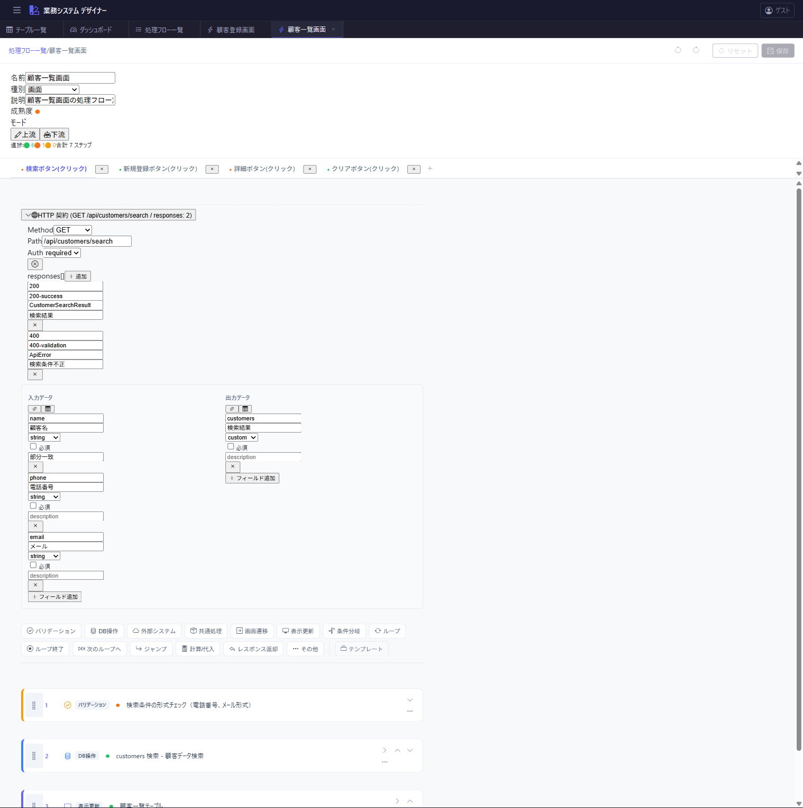
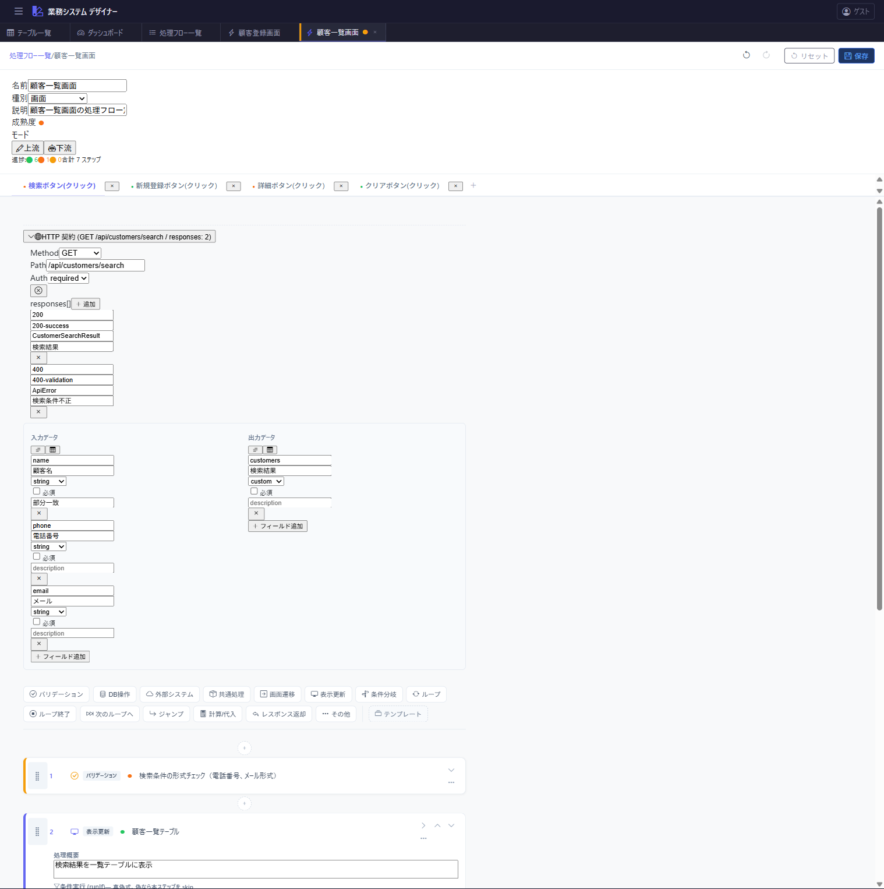
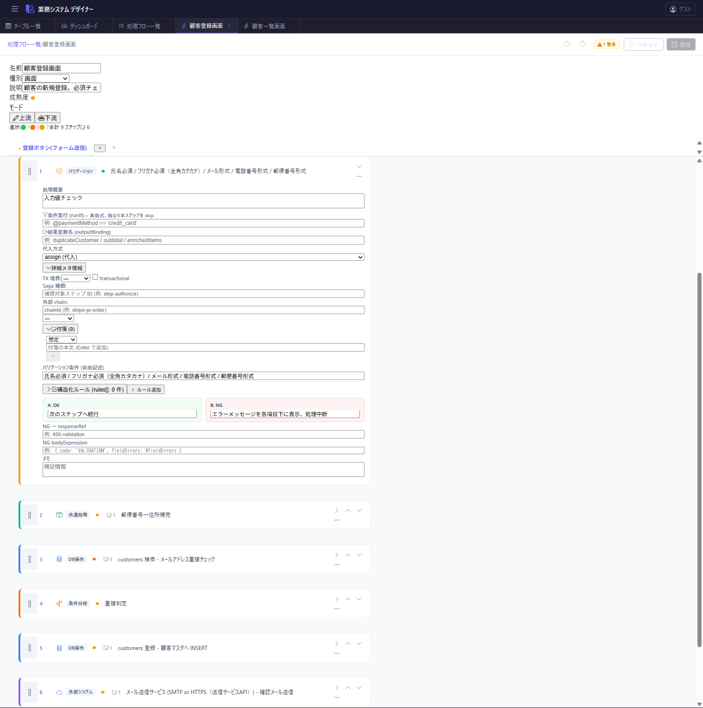
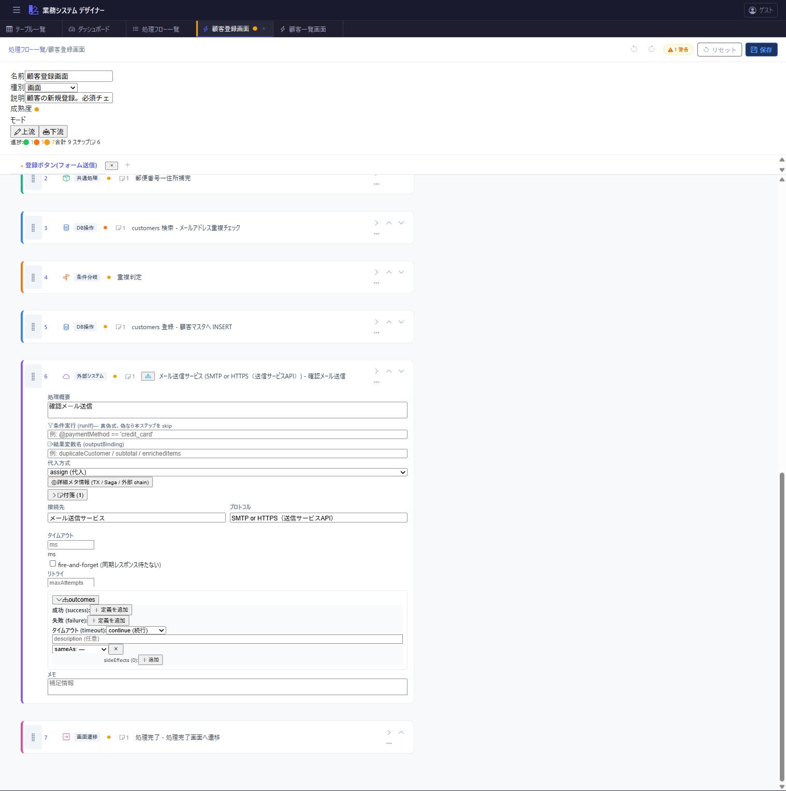
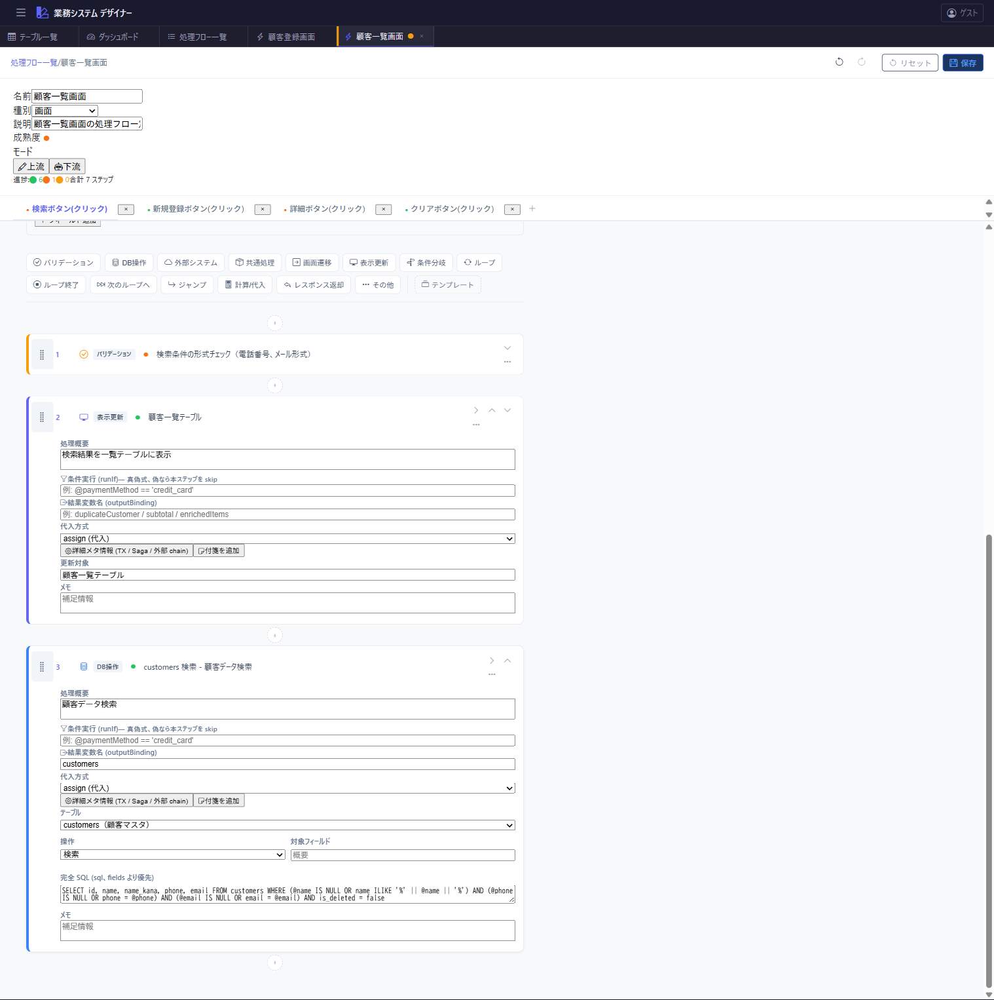
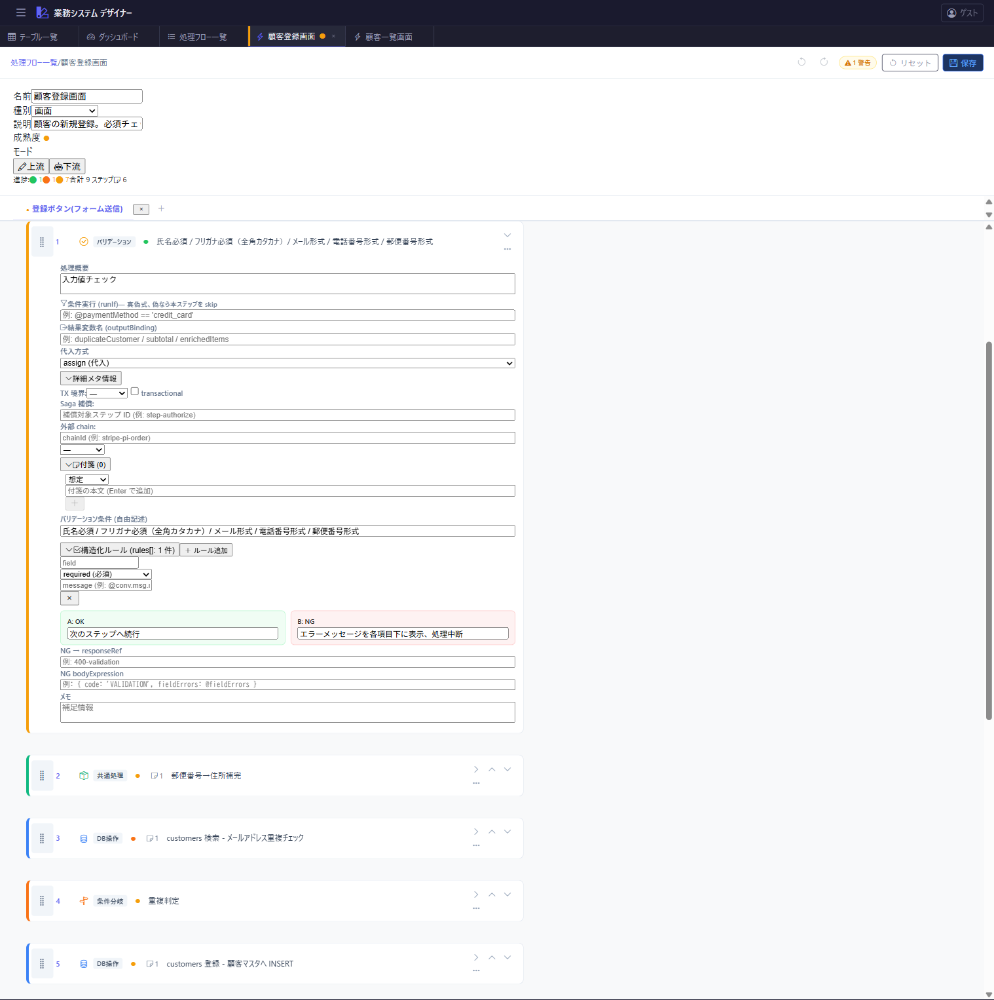
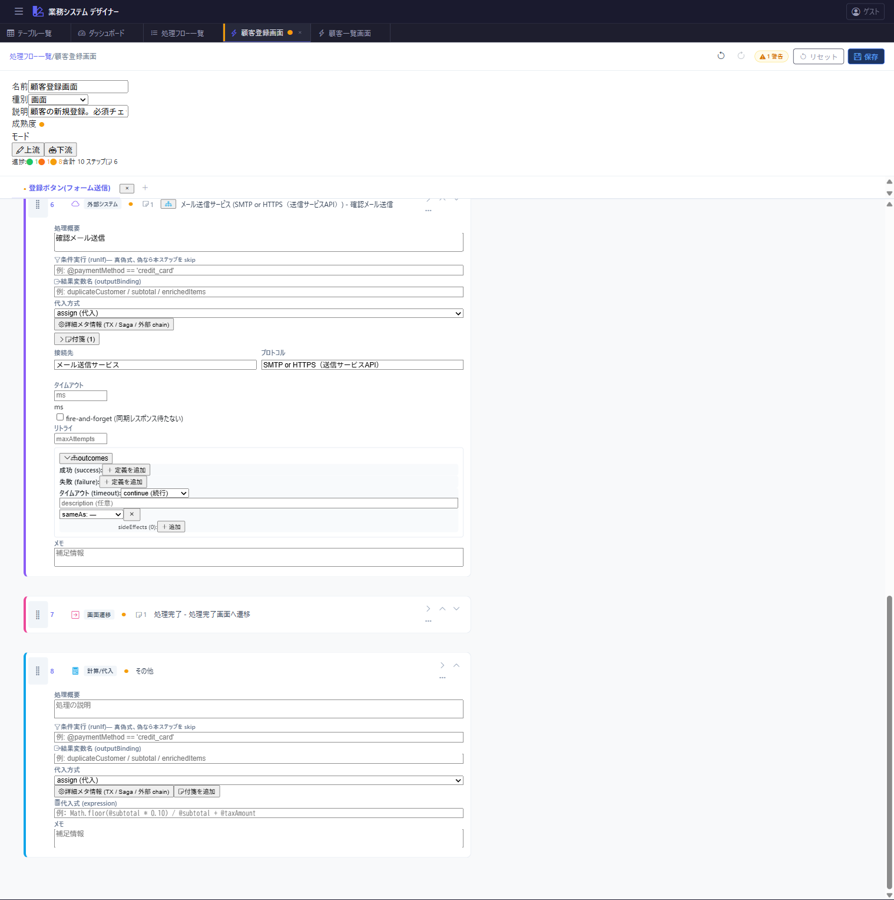

# 処理フロースキーマ拡張 (Phase B 包括リファレンス)

Issue: #182 (親: #151, #152)
策定日: 2026-04-20
ステータス: **初版** (ドッグフード 9 連続で 5.0/5 到達後に策定)

本ドキュメントは、`docs/spec/process-flow-maturity.md` / `process-flow-variables.md` の Phase 1 ベースライン以降に追加されたスキーマ拡張を網羅する**リファレンス**。個別設計思想は各 PR (#155〜#181) に記載。

**UI 対応**: 各機能の実際の UI は [`docs/ui-screenshots/`](../ui-screenshots/README.md) を参照。

**一次成果物 (機械可読)**: [`schemas/process-flow.schema.json`](../../schemas/process-flow.schema.json) — 外部 AI / CI からも参照可能な JSON Schema 2020-12。本ドキュメントの各節と 1:1 対応。

## 位置づけ

- **Phase 1 (基盤)**: `process-flow-maturity.md` / `process-flow-variables.md` に記載。maturity / notes / mode / StructuredField / outputBinding / argumentMapping の基盤
- **Phase B (本書)**: Phase 1 のドッグフード (#151 (B)) で発覚した「説明文 (description) 依存の業務概念」を構造化した 15 種のフィールド拡張
- **結果**: 別 AI セッションによる実装依頼で**自信度 5.0/5 / 地の文依存ゼロ / スキーマ確定可能** に到達 (#151 詳細)

## 1. HTTP 契約 (action レベル)

### 1.1 `action.httpRoute`

HTTP ハンドラ型 action の**ルート**を型付きで指定。自由記述だった「POST /api/customers」等を構造化。

```ts
interface HttpRoute {
  method: "GET" | "POST" | "PUT" | "PATCH" | "DELETE";
  path: string;                    // "/api/customers" or "/api/customers/:id"
  auth?: "required" | "optional" | "none";  // 既定 "required"
}
```

PR: #161

### 1.2 `action.responses[]`

action が返し得る **HTTP レスポンス一覧**を列挙。成功・各エラーをまとめて表現。

```ts
interface HttpResponseSpec {
  id?: string;                     // ReturnStep.responseRef が参照する ID
  status: number;                  // 201, 400, 409, ...
  contentType?: string;            // 既定 "application/json"
  bodySchema?: string;             // 自由記述 or 型名参照
  description?: string;
  when?: string;                   // 発生条件 (自由記述)
}
```

PR: #161 (初版) / #179 (`id` フィールド追加)

### 1.3 典型例

```json
"httpRoute": { "method": "POST", "path": "/api/orders", "auth": "required" },
"responses": [
  { "id": "201-success", "status": 201, "bodySchema": "{orderId, orderNumber}" },
  { "id": "409-stock-shortage", "status": 409, "bodySchema": "ApiError", "when": "@shortageList.length > 0" }
]
```

UI: 

## 2. ステップの実行制御

### 2.1 `StepBase.runIf`

ステップの**条件実行ガード**。式が偽の場合 skip。

```ts
runIf?: string;   // 自由記述の真偽式 or @conv.* 参照
```

用例: `"runIf": "@paymentMethod == 'credit_card'"`

PR: #179

UI: 

### 2.2 トランザクション境界 (`StepBase.txBoundary` / `transactional`)

同一 `txId` を持つステップ群が単一 TX 内で実行される想定。

```ts
interface TxBoundary {
  role: "begin" | "member" | "end";
  txId: string;                    // アクション内一意
}
// または簡易フラグ
transactional?: boolean;
```

PR: #163

### 2.3 Saga 補償 (`StepBase.compensatesFor`)

補償ステップから補償対象ステップへの**逆参照**。

```ts
compensatesFor?: string;   // ステップ ID
```

用例: Stripe cancel ステップが authorize ステップを指す

PR: #163

UI: 

### 2.4 外部呼出チェーン (`StepBase.externalChain`)

同一外部リソースを扱う複数ステップを束ねる。

```ts
interface ExternalChain {
  chainId: string;
  phase: "authorize" | "capture" | "cancel" | "other";
}
```

用例: Stripe PaymentIntent の 3 フェーズを `chainId: "stripe-pi-order"` で統一

PR: #163

## 3. 外部連携の outcome

### 3.1 `ExternalSystemStep.outcomes`

success / failure / timeout の 3 outcome に対するハンドリングを構造化。

```ts
type ExternalCallOutcome = "success" | "failure" | "timeout";

interface ExternalCallOutcomeSpec {
  action: "continue" | "abort" | "compensate";
  description?: string;
  jumpTo?: string;
  sideEffects?: Step[];            // action 実行前に走る副作用ステップ列
  sameAs?: ExternalCallOutcome;    // 他 outcome 定義の流用
}

outcomes?: Partial<Record<ExternalCallOutcome, ExternalCallOutcomeSpec>>;
```

PR: #159 (初版) / #173 (sideEffects / sameAs 追加)

### 3.2 `timeoutMs` / `retryPolicy` / `fireAndForget`

```ts
interface RetryPolicy {
  maxAttempts: number;
  backoff?: "fixed" | "exponential";
  initialDelayMs?: number;
}

timeoutMs?: number;                // 既定: product-scope §11 で 10000
retryPolicy?: RetryPolicy;         // 既定: なし
fireAndForget?: boolean;           // true なら同期レスポンス待たず即続行
```

PR: #159

### 3.3 典型例 (capture 失敗時の sideEffects)

```json
"outcomes": {
  "success": { "action": "continue" },
  "failure": {
    "action": "continue",
    "sideEffects": [
      { "type": "dbAccess", "operation": "UPDATE", "sql": "UPDATE orders SET status='payment_failed' WHERE id = @registeredOrder.id" },
      { "type": "other", "description": "Sentry error 記録" }
    ]
  },
  "timeout": { "action": "continue", "sameAs": "failure" }
}
```

UI: 

## 4. DB 操作の拡張

### 4.1 `DbAccessStep.sql`

完全な SQL 文を指定 (JOIN / RETURNING / サブクエリ等)。

```ts
sql?: string;       // 指定時は fields / operation より優先
```

PR: #171

UI: 

### 4.2 `DbAccessStep.affectedRowsCheck`

条件付き UPDATE / DELETE の影響行数チェック。rowCount 違反時の挙動を構造化。

```ts
type AffectedRowsOperator = ">" | ">=" | "=" | "<" | "<=";

interface AffectedRowsCheck {
  operator: AffectedRowsOperator;
  expected: number;
  onViolation: "throw" | "abort" | "log" | "continue";
  errorCode?: string;
  description?: string;
}
```

用例 (在庫引当):

```json
{
  "operation": "UPDATE",
  "sql": "UPDATE inventory SET stock = stock - @eitem.quantity WHERE item_id = @eitem.itemId AND stock >= @eitem.quantity",
  "affectedRowsCheck": {
    "operator": ">", "expected": 0,
    "onViolation": "throw", "errorCode": "STOCK_SHORTAGE"
  }
}
```

PR: #165

## 5. バリデーションの構造化

### 5.1 `ValidationStep.rules[]`

`conditions: string` の自由記述と併用可能な**構造化ルール配列**。

```ts
type ValidationRuleType =
  | "required" | "regex" | "maxLength" | "minLength"
  | "range" | "enum" | "custom";

interface ValidationRule {
  field: string;
  type: ValidationRuleType;
  pattern?: string;                // regex 用
  length?: number;                 // maxLength/minLength 用
  min?: number;                    // range 用
  max?: number;
  values?: string[];               // enum 用
  condition?: string;              // custom 用
  message?: string;                // @conv.msg.* 参照も可
}
```

PR: #167

UI: 

### 5.2 `inlineBranch.ngResponseRef` / `ngBodyExpression`

バリデーション NG 時の HTTP レスポンス返却を構造化。

```ts
inlineBranch?: {
  ok: string;
  ng: string;
  ngJumpTo?: string;
  ngResponseRef?: string;           // action.responses[].id 参照
  ngBodyExpression?: string;        // 返却 body 式
};
```

PR: #181

## 6. 新ステップ型

### 6.1 `ComputeStep` (`type: "compute"`)

計算式 / 変数代入を構造化。税額計算や累積処理に使う。

```ts
interface ComputeStep extends StepBase {
  type: "compute";
  expression: string;               // 代入式、outputBinding で結果変数名を指定
}
```

用例: `{ "type": "compute", "expression": "Math.floor(@subtotal * 0.10)", "outputBinding": "taxAmount" }`

PR: #175

UI: 

### 6.2 `ReturnStep` (`type: "return"`)

HTTP レスポンス返却を構造化。action.responses[] と突合する。

```ts
interface ReturnStep extends StepBase {
  type: "return";
  responseRef?: string;             // action.responses[].id 参照
  bodyExpression?: string;          // 返却 body 式
}
```

用例: `{ "type": "return", "responseRef": "409-stock-shortage", "bodyExpression": "{ code: 'STOCK_SHORTAGE', detail: @shortageList }" }`

PR: #179

## 7. 分岐条件の型付き variant

### 7.1 `BranchCondition` union

旧 `condition: string` を `string | BranchConditionVariant` に拡張。

```ts
type BranchConditionVariant =
  | { kind: "tryCatch"; errorCode: string; description?: string };

type BranchCondition = string | BranchConditionVariant;
```

用例 (Saga catch):

```json
"condition": { "kind": "tryCatch", "errorCode": "STOCK_SHORTAGE" }
```

PR: #177

## 8. 変数の構造化 (outputBinding 拡張)

### 8.1 `OutputBinding` union

旧 `outputBinding: string` を `string | OutputBindingObject` に拡張。

```ts
type OutputBindingOperation = "assign" | "accumulate" | "push";

interface OutputBindingObject {
  name: string;
  operation?: OutputBindingOperation;   // 既定 "assign"
}

type OutputBinding = string | OutputBindingObject;
```

用例:
- `"authResult"` (string = assign 既定)
- `{ "name": "subtotal", "operation": "accumulate" }` (ループ内累積)
- `{ "name": "enrichedItems", "operation": "push" }` (配列追加)

ヘルパー: `designer/src/utils/outputBinding.ts` の `getBindingName` / `getBindingOperation`

PR: #169

## 9. 後方互換性

すべての拡張は **Optional** かつ **Union 型** (string | structured) のいずれかで、既存データは破壊されない。`migrateActionGroup` が読み込み時に:

- 旧 `note: string` → `notes[{type:"assumption"}]`
- 旧 `condition: string` → そのまま (union 型)
- 旧 `inputs/outputs: string` → そのまま (union 型)
- 旧 `outputBinding: string` → そのまま (union 型)
- `maturity` 未指定 → `"draft"` 付与
- `mode` 未指定 → `"upstream"` 付与

テスト: 既存 347 ユニットテストはすべてパス (破壊的変更なし)。

## 10. ドッグフード検証の根拠

本スキーマは以下のドッグフード履歴で**説明文ゼロ依存・自信度 5.0/5・スキーマ確定可能 (YES)** を達成:

- `data/actions/cccccccc-0019-*.json` で別 AI セッションに実装依頼 → 地の文を無視して機能的に完全な実装生成可能と判定
- 詳細履歴: #151 最終コメント

## 11. 関連

- `docs/spec/process-flow-maturity.md` — Phase 1 (成熟度・付箋・モード)
- `docs/spec/process-flow-variables.md` — Phase 1 (入出力・変数基盤)
- `docs/conventions/validation-rules.md` / `product-scope.md` — 横断規約 (placeholder)
- `designer/src/types/action.ts` — 型定義の正 (実装とドキュメントの整合性はこちらが優先)

## 12. 変更履歴

- 2026-04-20: 初版。#155〜#181 の全 PR をカバー。
