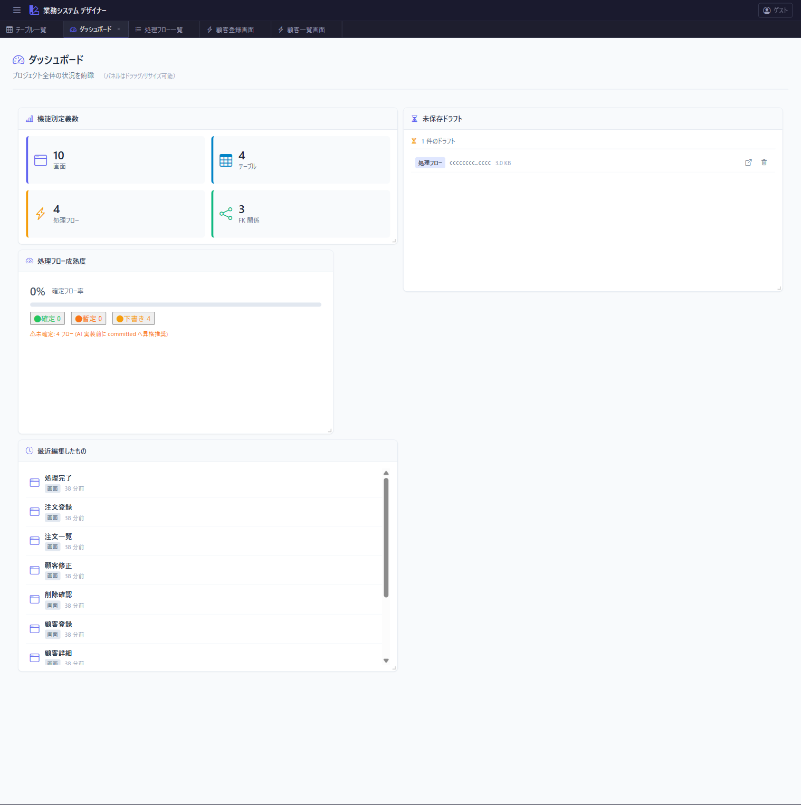
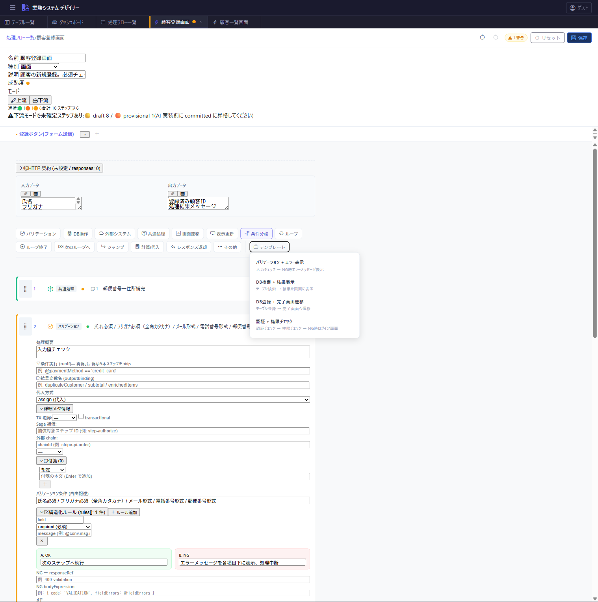

# 処理フローの成熟度・曖昧さ管理

**改訂日: 2026-04-28 (v3 反映)**

Issue: #152 (親トラッキング: #151)
策定日: 2026-04-20
ステータス: **v1.0 (凍結 2026-04-24)** — データモデル・UI 仕様確定。Phase 実装中は本書を改訂せず、追加仕様は新規ドキュメントに分離する

本ドキュメントは、処理フロー機能を**上流工程 (人間が仕様を書く時) と下流工程 (AI が仕様を読んで実装する時) で兼用する**ための「曖昧さ管理」の仕様を定める。

## 1. 目的

処理フローは上流 → 下流に向けて段階的に詳細化される。上流時点では必然的に **未確定・想定・将来検討** を含むが、下流時点では AI エージェントが迷わず実装できる粒度まで確定している必要がある。

本仕様は、この「成熟度の違い」をデータとして一級市民 (first class) にし、以下を実現する:

- **穴の可視化**: どこが未確定かが一目で分かる
- **モード別バリデーション**: 上流では緩く、下流では厳しく
- **AI への信頼できる受け渡し**: 「ここは確定、ここは想定」を明示的に伝達

## 2. 背景

2026-04-20 のドッグフード (別 AI セッションに 4 サンプル `cccccccc-0005..0008` を実装依頼) 結果:

- 自信度 **2/5**、本番投入不可
- 曖昧さのパターン 10 類型に分類、特に「**未設計リソース / 想定 / 将来検討 の乱用**」が致命的
- 現状 `note: "想定: ..."` が頻出するが、「仕様のどの部分が確定 / 未確定か」の識別情報として機能していない (すべて同じ note 欄に詰め込まれている)

→ 成熟度と付箋を構造化することで、下流モードでのバリデーション・ダッシュボード・AI 受け渡しが実現可能になる。

## 3. 成熟度 (Maturity) の 3 値

処理フロー内の各要素は以下 3 値のいずれかを持つ:

| 値 | 意味 | UI バッジ | 既定 |
|---|---|---|---|
| `draft` | 下書き。書きかけ、頻繁に変わる | 🟡 | ✓ |
| `provisional` | 暫定。現時点の想定、未確認事項あり | 🟠 | |
| `committed` | 確定。下流に渡して良い | 🟢 | |

明示的に昇格・降格する。

UI サンプル:
- 一覧での maturity サマリバー + フィルタ: 
- ダッシュボード成熟度パネル: 
- 下流モード切替時の未確定警告: 

### 粒度 (どこに付くか)

v3 では `meta.maturity` がフロー単位の成熟度を担う。

- **ステップ単位** (`step.maturity`): ステップ全体の成熟度
- **アクション単位** (`action.maturity`): アクションのまとまりとしての成熟度
- **処理フロー単位** (`meta.maturity`): フロー全体の成熟度

v1 はアクション単位まで。フィールド粒度 (例: `step.inputs` だけ draft) は Phase 3。

v3 形式の例:

```json
{
  "meta": {
    "id": "11111111-1111-4111-8111-111111111111",
    "name": "注文処理",
    "maturity": "committed",
    "mode": "upstream"
  }
}
```

## 4. 付箋 (Notes)

従来の `step.note: string` を拡張し、**複数の付箋を種別付きで**持てるようにする。

```ts
interface StepNote {
  id: string;
  type: "assumption" | "prerequisite" | "todo" | "deferred" | "question";
  body: string;
  createdAt: string;  // ISO timestamp
}

interface StepBase {
  // 既存
  note?: string;       // 旧形式、後方互換
  // 新規
  notes?: StepNote[];
}
```

### 付箋種別

| type | 意味 | アイコン | 用途 |
|---|---|---|---|
| `assumption` | 想定 | 💭 | 「こう仮定して書いた」を明示 |
| `prerequisite` | 前提 | 📎 | 別機能の設計が先に必要なとき |
| `todo` | TODO | ☑ | 後で埋める作業項目 |
| `deferred` | 将来検討 | 🕒 | 今は書かないと明示 |
| `question` | 質問 | ❓ | 未解決の疑問 |

### 旧 `note` との関係

- 読み込み時: 旧 `note: string` は `notes: [{type: "assumption", body: note, createdAt: now}]` に自動変換
- 書き込み時: `notes[]` を正として保存、旧 `note` は省略
- データ破壊はしない

## 5. モード (上流 / 下流)

v3 では `meta.mode` でモードを宣言する:

```json
{
  "meta": {
    "id": "11111111-1111-4111-8111-111111111111",
    "name": "注文処理",
    "mode": "upstream"
  }
}
```

### モード別の挙動差

| 項目 | 上流モード | 下流モード |
|---|---|---|
| フィールド未入力 | ◎ 許容 (穴として記録) | △ 警告 |
| `maturity: draft` の混在 | ◎ | ✕ エラー (`provisional` 以上必須) |
| 外部連携ステップの outcome 未定義 | ◎ | △ 警告 |
| 保存 | 可 | 成熟度 NG でも可だが警告表示 |
| AI への受け渡しエクスポート | ✕ 不可 | ◎ 可 |

保存自体は常に可能。モードは**そのフローが今どの工程か**を宣言するメタ情報であり、ロックではない。

## 6. UI 要素

### 6.1 成熟度バッジ

ステップカード右上に 🟡/🟠/🟢 バッジ。クリック or ドロップダウンで昇格・降格。アクションカードとフロー一覧にも同様のバッジ。

### 6.2 付箋パネル

ステップカード下部に折りたたみ可能な付箋パネル。「+ 付箋を追加」ボタン → 種別選択 → 本文入力。アイコン + 一行サマリで表示、展開で本文全体。

### 6.3 モード切替

処理フロー編集画面ヘッダに「上流モード / 下流モード」のトグル。切替時、現在の未確定項目数を確認ダイアログで表示。

### 6.4 成熟度ダッシュボード

処理フロー編集画面ヘッダと処理フロー一覧の各行に:

```
🟢 12 / 🟠 3 / 🟡 2  |  💭 5 📎 1 ☑ 2 🕒 1 ❓ 0
```

クリックで対応する項目だけにフィルタ。

### 6.5 未確定フィルタ

処理フロー編集画面に「未確定のみ表示」ボタン。`draft` および `provisional` のステップだけ表示、他は折りたたみ。

### 6.6 AI 受け渡しエクスポート (Phase 3)

下流モードのフローに「AI 向けにエクスポート」ボタン。成熟度と付箋をメタ情報として含む JSON を出力。AI 側は「確定 vs 想定」を識別可能。

## 7. データモデル (後方互換)

### 追加フィールド一覧 (v3)

| 型 | フィールド | 既定 | 後方互換 |
|---|---|---|---|
| `StepBase` | `maturity?: Maturity` | `"draft"` | 無しなら draft |
| `StepBase` | `notes?: StepNote[]` | — | 旧 `note` を自動変換 |
| `ActionDefinition` | `maturity?` | `"draft"` | 同上 |
| `ProcessFlow.meta` | `maturity?` | `"draft"` | 同上 |
| `ProcessFlow.meta` | `mode?: "upstream"\|"downstream"` | `"upstream"` | 同上 |

### マイグレーション

既存 JSON は無変更で動作。初回保存時に上記の既定値が自動付与される。マイグレーションスクリプトは不要 (読み込み時補完)。

## 8. Phase 分け

| Phase | 内容 | 視覚影響 | 規模 |
|---|---|---|---|
| 1 | データモデル追加 + 成熟度バッジ + `notes[]` への移行 UI | 小 | 中 |
| 2 | モード切替 + 下流バリデーション + 成熟度ダッシュボード + 未確定フィルタ | 中 | 中 |
| 3 | フィールド粒度の maturity + AI 向けエクスポート | 大 | 大 |

## 9. 受け入れ条件

> これらは実装フェーズの追跡チェックリストです。凍結は設計確定を意味し、実装完了を意味しません。

- [ ] ステップ・アクション・処理フローに `maturity` フィールドが追加され、JSON に永続化される
- [ ] 既存 JSON (maturity 欄なし) は `draft` として読み込まれ、初回保存で付与される
- [ ] 既存 `note: string` は `notes: [{type: "assumption"}]` に自動変換される
- [ ] 付箋の 5 種別が UI から追加・編集・削除できる
- [ ] ステップカード右上に 🟡/🟠/🟢 バッジが表示され、昇格・降格できる
- [ ] 各フローに上流/下流モードトグルがあり、JSON に保存される
- [ ] 下流モード + 未確定項目ありで、保存時に警告を出す
- [ ] 成熟度ダッシュボードが処理フロー編集画面ヘッダと一覧行に表示される
- [ ] 「未確定のみ表示」フィルタが機能する
- [ ] 既存の Vitest / Playwright テストが引き続き通る
- [ ] docs/spec/process-flow-maturity.md (本書) の仕様と実装が逐条一致する

## 10. スコープ外 (将来検討)

- フィールド粒度 (入力・出力・条件式など個別) の maturity — Phase 3 に含める可能性
- 成熟度の変更履歴 (いつ committed になったか)
- 複数人編集時のレビュー・承認フロー
- 付箋へのコメント・スレッド機能
- AI への自動受け渡し (MCP ツール経由)

## 11. 関連仕様

- スキーマ: `schemas/v3/process-flow.v3.schema.json` — `ProcessFlowMeta` / `StepBase` (maturity / notes)
- `docs/spec/process-flow-variables.md` — 入出力・変数の構造化
- `docs/spec/process-flow-extensions.md` — Phase B 以降のスキーマ拡張
- `docs/spec/list-common.md` — 一覧系 UI 共通仕様 (変更なし、本仕様は独立)

## 12. 変更履歴

- 2026-04-20: 初版ドラフト。ドッグフード結果 (別 AI セッション実装依頼) に基づき策定
- 2026-04-24: v1.0 凍結。データモデル (maturity/notes/mode) と UI 仕様の設計は確定済と判定
- 2026-04-28: v3 反映。`meta.maturity` / `meta.mode` の配置を v3 スキーマに整合
